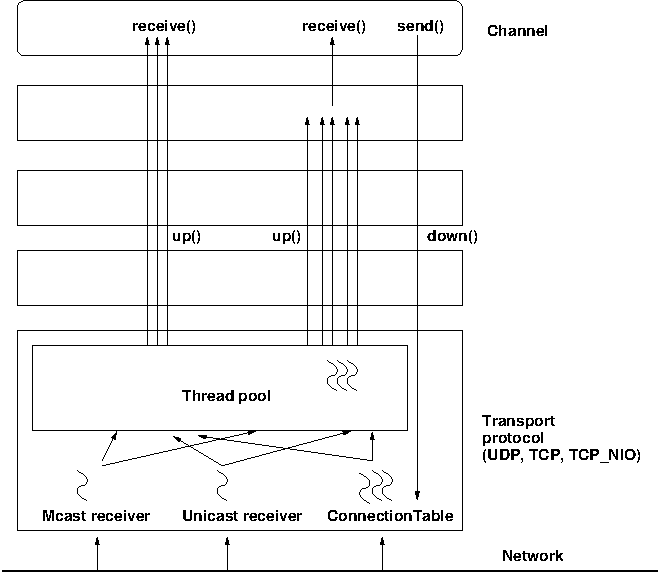
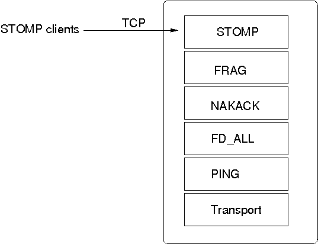
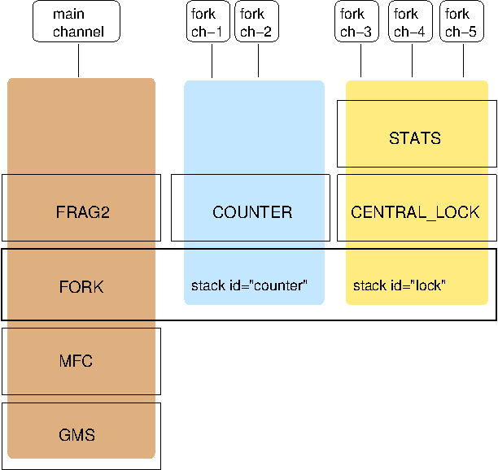

[[user-advanced]]
== Advanced Concepts

This chapter discusses some of the more advanced concepts of JGroups with respect to using it and setting it
up correctly.
    

=== Using multiple channels
When using a fully virtual synchronous protocol stack, the performance may not be great because of the
larger number of protocols present. For certain applications, however, throughput is more important than
ordering, e.g. for video/audio streams or airplane tracking. In the latter case, it is important that
airplanes are handed over between control domains correctly, but if there are a (small) number of radar
tracking messages (which determine the exact location of the plane) missing, it is not a problem. The first
type of messages do not occur very often (typically a number of messages per hour), whereas the second type of
messages would be sent at a rate of 10-30 messages/second. The same applies for a distributed whiteboard:
messages that represent a video or audio stream have to be delivered as quick as possible, whereas messages
that represent figures drawn on the whiteboard, or new participants joining the whiteboard have to be
delivered according to a certain order.

The requirements for such applications can be solved by using two separate channels: one for control messages
such as group membership, floor control etc and the other one for data messages such as video/audio streams
(actually one might consider using one channel for audio and one for video). The control channel might use
virtual synchrony, which is relatively slow, but enforces ordering and retransmission, and the data channel
might use a simple UDP channel, possibly including a fragmentation layer, but no retransmission layer (losing
packets is preferred to costly retransmission).
        

=== Transport protocols

A _transport protocol_ refers to the protocol at the bottom of the protocol stack which is
            responsible for sending messages to and receiving messages from the network. There are a number of transport
            protocols in JGroups. They are discussed in the following sections.
        

A typical protocol stack configuration using UDP is:
        

[source,xml]
----
<config xmlns="urn:org:jgroups"
        xmlns:xsi="http://www.w3.org/2001/XMLSchema-instance"
        xsi:schemaLocation="urn:org:jgroups http://www.jgroups.org/schema/jgroups.xsd">
    <UDP
         mcast_port="${jgroups.udp.mcast_port:45588}"
         ucast_recv_buf_size="5M"
         ucast_send_buf_size="640K"
         mcast_recv_buf_size="5M"
         mcast_send_buf_size="640K"
         max_bundle_size="64K"
         ip_ttl="${jgroups.udp.ip_ttl:2}"
         enable_diagnostics="true"

         thread_pool.min_threads="2"
         thread_pool.max_threads="8"
         thread_pool.keep_alive_time="5000"/>

    <PING />
    <MERGE3 max_interval="30000"
            min_interval="10000"/>
    <FD_SOCK/>
    <FD_ALL/>
    <VERIFY_SUSPECT timeout="1500"  />
    <BARRIER />
    <pbcast.NAKACK2 use_mcast_xmit="true"
                   discard_delivered_msgs="true"/>
    <UNICAST3 />
    <pbcast.STABLE stability_delay="1000" desired_avg_gossip="50000"
                   max_bytes="4M"/>
    <pbcast.GMS print_local_addr="true" join_timeout="2000"/>
    <UFC max_credits="2M"
         min_threshold="0.4"/>
    <MFC max_credits="2M"
         min_threshold="0.4"/>
    <FRAG2 frag_size="60K"  />
    <pbcast.STATE_TRANSFER />
</config>
----

In a nutshell the properties of the protocols are:
    

UDP:: 
                    This is the transport protocol. It uses IP multicasting to send messages to the entire cluster,
                        or individual nodes. Other transports include TCP, TCP_NIO2 and TUNNEL.
                    

PING::
                    This is the discovery protocol. It uses IP multicast (by default) to find initial members.
                        Once found, the current coordinator can be determined and a unicast JOIN request will be sent
                        to it in order to join the cluster.
                    

MERGE3::
                    Will merge sub-clusters back into one cluster, kicks in after a network partition healed.

FD_SOCK::
                    Failure detection based on sockets (in a ring form between members). Generates notification
                        if a member fails
                    

FD / FD_ALL::
                    Failure detection based on heartbeat are-you-alive messages. Generates notification
                        if a member fails

VERIFY_SUSPECT::
                    Double-checks whether a suspected member is really dead,
                        otherwise the suspicion generated from protocol below is discarded

BARRIER::
                    Needed to transfer state; this will block messages that modify the shared state until a
                        digest has been taken, then unblocks all threads. _Not needed if no state transfer protocol is present._
                    

pbcast.NAKACK2::
                    Ensures (a) message reliability and (b) FIFO. Message
                        reliability guarantees that a message will be received. If not,
                        the receiver(s) will request retransmission. FIFO guarantees that all
                        messages from sender P will be received in the order P sent them

UNICAST3::
                    Same as NAKACK for unicast messages: messages from sender P
                        will not be lost (retransmission if necessary) and will be in FIFO
                        order (conceptually the same as TCP in TCP/IP)

pbcast.STABLE::
                    Deletes messages that have been seen by all members (distributed message garbage collection)

pbcast.GMS::
                    Membership protocol. Responsible for joining/leaving members and installing new views.

UFC::
                    Unicast Flow Control. Provides flow control between 2 members.
                    

MFC::
                    Multicast Flow Control. Provides flow control between a sender and all cluster members.
                    

FRAG2::
                    Fragments large messages into smaller ones and reassembles
                        them back at the receiver side. For both multicast and unicast messages

STATE_TRANSFER::
                    Ensures that state is correctly transferred from an existing member (usually the coordinator) to a
                        new member.
                    

[[MessageBundling]]
==== Message bundling

Message bundling is beneficial when sending many small messages; they are queued until a threshold (number of bytes)
has been exceeded. Then, the queued messages are assembled into a message batch (see <<MessageBatch>>) and the batch
is sent.

At the receiver, the message batch is passed up the stack, so protocols and/or the application can process multiple
messages in one shot.

When sending many smaller messages, the ratio between payload and message headers might be small; say we
send a "hello" string: the payload here is 7 bytes, whereas the addresses and headers (depending on the
stack configuration) might be 30 bytes. However, if we bundle (say) 100 messages, then the payload of
the large message is 700 bytes, but the header is still 30 bytes. Thus, we're able to send more
actual data across the wire with a message batch than with many small messages.

NOTE: A message batch of 100 messages contains the sender's and destination address and the cluster name only _once_.
      If the cluster name is 10 bytes, then we save roughly
      `99*10 + 99 * 18 *2` (assuming non-null destination addresses and IPv4) = `4500` bytes.
            
Message bundling/batching is conceptually similar to TCP's Nagle algorithm.
            

A sample configuration is shown below:

[source,xml]
----
<UDP max_bundle_size="64K"/>
----

Here, bundling is enabled (the default). The max accumulated size is 64'000 bytes.

If at time T0, we're sending 10 smaller messages with an accumulated size of 2'000 bytes, but
then send no more messages, then a message batch of 10 will be sent immediately after the 10th message has been sent.

If we send 1000 messages of 100 bytes each, then - after exceeding 64'000 bytes (after ca. 64 messages) - we'll
send the message batch, and this might have taken only 3 ms.
            

NOTE: Since 3.x, message bundling is the default, and it cannot be enabled or disabled anymore (the config
      is ignored). However, a message can set the `DONT_BUNDLE` flag to skip message bundling. This is only recognized
      for OOB messages, so if a message needs to skip bundling, it needs to have flags `OOB` and `DONT_BUNDLE` set.

[[MessageBundlingAndPerf]]
===== Message bundling and performance

As with Nagling, message bundling/batching can affect latency. In most scenarios, latency should be small as a message
batch is sent when either `max_bundle_size` bytes have accumulated, or no more messages are sent. The algorithm for
bundling looks more or less like this:

....
If enough space in the queue:
    queue message, get next message
If max_bundle_size exceeded, or no more message -> send message batch
....
                
When the message send rate is high and/or many large messages are sent, latency is more or less the time to fill
`max_bundle_size`. This should be sufficient for a lot of applications. If not, flags `OOB` and `DONT_BUNDLE` can be
used to bypass bundling.

==== UDP

UDP uses _IP multicasting_ for sending messages to all members of a cluster, and
_UDP datagrams_ for unicast messages (sent to a single member). When started, it
opens a unicast and multicast socket: the unicast socket is used to send/receive unicast messages,
while the multicast socket sends/receives multicast messages. The physical address of the channel will
be the address and port number of the _unicast_ socket.
            

===== Using UDP and plain IP multicasting

A protocol stack with UDP as transport protocol is typically used with clusters whose members run on
                    the same host or are distributed across a LAN. Note that before running instances
                    _in different subnets_, an admin has to make sure that IP multicast is enabled
                    across subnets. It is often the case that IP multicast is not enabled across subnets.
                    Refer to section <<ItDoesntWork>> for running a test program that determines whether
                    members can reach each other via IP multicast. If this does not work, the protocol stack cannot use
                    UDP with IP multicast as transport. In this case, the stack has to either use UDP without IP
                    multicasting, or use a different transport such as TCP.
                

[[IpNoMulticast]]
===== Using UDP without IP multicasting

The protocol stack with UDP and PING as the bottom protocols use IP multicasting by default to
send messages to all members (UDP) and for discovery of the initial members (PING). However, if
multicasting cannot be used, the UDP and PING protocols can be configured to send multiple unicast
messages instead of one multicast message.

NOTE: Although not as efficient (and using more bandwidth), it is sometimes the only possibility
      to reach group members.
                

To configure UDP to use multiple unicast messages to send a group message instead of using IP
                    multicasting, the `ip_mcast` property has to be set to +false+.
                

If we disable ip_mcast, we now also have to change the discovery protocol (PING). Because PING
                    requires IP multicasting to be enabled in the transport, we cannot use it. Some of the alternatives
                    are TCPPING (static list of member addresses), TCPGOSSIP (external lookup service), FILE_PING
                    (shared directory), BPING (using broadcasts) or JDBC_PING (using a shared database).
                

See <<DiscoveryProtocols>> for details on configuration of different discovery protocols.
                

==== TCP

TCP is a replacement for UDP as transport in cases where IP multicast cannot be used.
                This may be the case when operating over a WAN, where routers might discard IP multicast packets.
                Usually, UDP is used as transport in LANs, while TCP is used for clusters spanning WANs.
            

The properties for a typical stack based on TCP might look like this (edited for brevity):
            

[source,xml]
----

<TCP bind_port="7800" />
<TCPPING initial_hosts="${jgroups.tcpping.initial_hosts:HostA[7800],HostB[7801]}"
         port_range="1"/>
<VERIFY_SUSPECT timeout="1500"  />
<pbcast.NAKACK2 use_mcast_xmit="false"
                discard_delivered_msgs="true"/>
<UNICAST3/>
<pbcast.STABLE stability_delay="1000" desired_avg_gossip="50000"
               max_bytes="400000"/>
<pbcast.GMS print_local_addr="true" join_timeout="2000"/>
----

TCP:: The transport protocol, uses TCP (from TCP/IP) to send unicast and multicast messages. In the latter case, it sends
      multiple unicast messages.

TCPPING:: Discovers the initial membership to determine coordinator. Join request will then be sent to coordinator.

VERIFY_SUSPECT:: Double checks that a suspected member is really dead

pbcast.NAKACK2:: Reliable and FIFO multicast message delivery

UNICAST3:: Reliable unicast message delivery

pbcast.STABLE:: Distributed garbage collection of messages seen by all members

pbcast.GMS:: Membership services. Takes care of joining and removing new/old members, emits view changes

When using TCP, each message to all of the cluster members is sent as multiple unicast messages
(one to each member). Due to the fact that IP multicasting cannot be used to discover the initial
members, another mechanism has to be used to find the initial membership. There are a number of
alternatives (see <<DiscoveryProtocols>> for a discussion of all discovery protocols):
            

* TCPPING: uses a list of well-known group members that it contacts for initial membership
* TCPGOSSIP: this requires a GossipRouter (see below), which is an external process, acting
             as a lookup service. Cluster members register with under their cluster name, and new members
             query the GossipRouter for initial cluster membership information.

==== TCP_NIO2
This is a TCP/IP based implementation based on non blocking IO (NIO2).

Details at <<TCP_NIO2>>.

[[TCPPING]]
===== Using TCP and TCPPING

A protocol stack using TCP and TCPPING looks like this (other protocols omitted):
                

[source,xml]
----

<TCP bind_port="7800" /> +
<TCPPING initial_hosts="HostA[7800],HostB[7800]"
         port_range="2" />
----

The concept behind TCPPING is that some selected cluster members assume the role of well-known hosts
                    from which the initial membership information can be retrieved. In the example,
                    HostA and HostB are designated members that will be
                    used by TCPPING to lookup the initial membership. The property bind_port
                    in TCP means that each member should try to assign port 7800 for itself.
                    If this is not possible it will try the next higher port (++7801++) and so on, until
                    it finds an unused port.
                

TCPPING will try to contact both HostA and
                    HostB, starting at port +7800+ and ending at port
                    +$$7800 + port_range$$+, in the above example ports +7800+ -
                    +7802+. Assuming that at least one of HostA or
                    HostB is up, a response will be received. To be absolutely sure to receive
                    a response, it is recommended to add all the hosts on which members of the cluster will be running
                    to the configuration.
                

[[TCPGOSSIP]]

===== Using TCP and TCPGOSSIP

TCPGOSSIP uses one or more GossipRouters to (1) register itself and (2)
                    fetch information about already registered cluster members. A configuration looks like this:
                

[source,xml]
----

<TCP />
<TCPGOSSIP initial_hosts="HostA[5555],HostB[5555]" />
                
----

The initial_hosts property is a comma-delimited list of GossipRouters.
                    In the example there are two GossipRouters on HostA and HostB, at port +5555+.
                

A member always registers with all GossipRouters listed, but fetches information from the first
                    available GossipRouter. If a GossipRouter cannot be accessed, it will be marked as failed and removed
                    from the list. A task is then started, which tries to periodically reconnect to the failed process.
                    On reconnection, the failed GossipRouter is marked as OK, and re-inserted into the list.
                

The advantage of having multiple GossipRouters is that, as long as at least one is running,
                    new members will always be able to retrieve the initial membership.
                

Note that the GossipRouter should be started before any of the members.
                

[[TUNNEL_Advanced]]

==== TUNNEL

Firewalls are usually placed at the connection to the internet. They shield local networks from outside
                attacks by screening incoming traffic and rejecting connection attempts to host inside the firewalls by
                outside machines. Most firewall systems allow hosts inside the firewall to connect to hosts outside it
                (outgoing traffic), however, incoming traffic is most often disabled entirely.
            

_Tunnels_ are host protocols which encapsulate other protocols by multiplexing them
                at one end and demultiplexing them at the other end. Any protocol can be tunneled by a tunnel protocol.
            

The most restrictive setups of firewalls usually disable _all_ incoming traffic, and
                only enable a few selected ports for outgoing traffic. In the solution below, it is
                assumed that one TCP port is enabled for outgoing connections to the GossipRouter.
            

JGroups has a mechanism that allows a programmer to tunnel a firewall. The solution involves a
                GossipRouter, which has to be outside of the firewall, so other members (possibly also behind firewalls)
                can access it.
            

The solution works as follows. A channel inside a firewall has to use protocol TUNNEL instead of UDP or
                TCP as transport. The recommended discovery protocol is PING. Here's a configuration:
            

[source,xml]
----

<TUNNEL gossip_router_hosts="HostA[12001]" />
<PING />
            
----

TUNNEL uses a GossipRouter (outside the firewall) running on HostA at port
                +12001+ for tunneling. Note that it is not recommended to use TCPGOSSIP for discovery if
                TUNNEL is used (use PING instead). TUNNEL accepts one or multiple GossipRouters tor tunneling;
                they can be listed as a comma delimited list of host[port] elements specified in property
                gossip_router_hosts.
            

TUNNEL establishes a TCP connection to the _GossipRouter_
                process (outside the firewall) that accepts messages from members and passes them on to other
                members. This connection is initiated by the host inside the firewall and persists as long as the channel
                is connected to a group. A GossipRouter will use the _same connection_
                to send incoming messages to the channel that initiated the connection. This is perfectly legal, as TCP
                connections are fully duplex. Note that, if GossipRouter tried to establish its own TCP connection to the
                channel behind the firewall, it would fail. But it is okay to reuse the existing TCP connection,
                established by the channel.
            

Note that TUNNEL has to be given the hostname and port of the GossipRouter process.
                This example assumes a GossipRouter is running on HostA at port++12001++.
                TUNNEL accepts one or multiple router hosts as a comma delimited list of host[port] elements specified in
                property gossip_router_hosts.
            

Any time a message has to be sent, TUNNEL forwards the message to GossipRouter, which distributes it to
its destination: if the message's destination field is null (send to all group members), then GossipRouter
looks up the members that belong to that group and forwards the message to all of them via the TCP
connections they established when connecting to GossipRouter. If the destination is a valid member address,
then that member's TCP connection is looked up, and the message is forwarded to it.

NOTE: To do so, GossipRouter maintains a mapping between cluster names and member addresses, and TCP connections.

A GossipRouter is not a single point of failure. In a setup with multiple gossip routers, the routers do
                not communicate among themselves, and a single point of failure is avoided by having each channel simply
                connect to multiple available routers. In case one or more routers go down, the cluster members are still
                able to exchange messages through any of the remaining available router instances, if there are any.
            

For each send invocation, a channel goes through a list of available connections to routers and attempts
                to send the message on each connection until it succeeds. If a message can not be sent on any of the
                connections, an exception is raised. The default policy for connection selection is random. However, we
                provide an plug-in interface for other policies as well.
            

The GossipRouter configuration is static and is not updated for the lifetime of the channel. A list of
                available routers has to be provided in the channel's configuration file.
            

To tunnel a firewall using JGroups, the following steps have to be taken:
            

- [*] Check that a TCP port (e.g. 12001) is enabled in the firewall for outgoing traffic
- [*] Start the GossipRouter:
                        
----
java org.jgroups.stack.GossipRouter -port 12001
----

- [*] Configure the TUNNEL protocol layer as instructed above.
- [*] Create a channel

The general setup is shown in <<TunnelingFig>>:

[[TunnelingFig]]
.Tunneling a firewall
image::./images/Tunneling.png[]

First, the GossipRouter process is created on host B. Note that host B should be outside the firewall,
                and all channels in the same group should use the same GossipRouter process. When a channel on host A is
                created, its TCPGOSSIP
                protocol will register its address with the GossipRouter and retrieve the initial membership (assume this
                is C). Now, a TCP connection with the GossipRouter is established by A; this will persist until A crashes
                or voluntarily leaves the group. When A multicasts a message to the cluster, GossipRouter looks up all cluster
                members (in this case, A and C) and forwards the message to all members, using their TCP connections. In
                the example, A would receive its own copy of the multicast message it sent, and another copy would be sent
                to C.
            

This scheme allows for example
                _Java applets_
                , which are only allowed to connect back to the host from which they were downloaded, to use JGroups: the
                HTTP server would be located on host B and the gossip and GossipRouter daemon would also run on that host.
                An applet downloaded to either A or C would be allowed to make a TCP connection to B. Also, applications
                behind a firewall would be able to talk to each other, joining a group.
            

However, there are several drawbacks: first, having to maintain a TCP connection for the duration of the
                connection might use up resources in the host system (e.g. in the GossipRouter), leading to scalability
                problems, second, this scheme is inappropriate when only a few channels are located behind firewalls, and
                the vast majority can indeed use IP multicast to communicate, and finally, it is not always possible to
                enable outgoing traffic on 2 ports in a firewall, e.g. when a user does not 'own' the firewall.
            

[[TransportDetails]]
=== The transport in detail

The transport is always the protocol at the bottom of the stack, responsible for sending and receiving messages.

It contains most of the resources, such as the thread pool for handling of incoming messages, sockets for sending and
receiving of messages, and thread and socket factories.

The transport is shown in <<TransportDetailsFig>>.

[[TransportDetailsFig]]
.The transport protocol

The transport consists of a thread pool (`java.util.concurrent.ThreadPoolExecutor`) which handles all types of messages
(internal, OOB and regular) and is also used by the timer to fire tasks (e.g. retransmission tasks) at fixed or
dynamic intervals.

When a (UDP or TCP) socket receives a message or message batch, it passes the message to the thread pool for
processing.

When the thread pool is disabled, then we use the thread of the caller (e.g. multicast or unicast
receiver threads or the ConnectionTable) to send the message up the stack and into the application.

Otherwise, the packet will be processed by a thread from the thread pool, which sends the message up
the stack. When all current threads are busy, another thread might be created, up to the maximum number
of threads defined. Alternatively, the packet might get dropped if the pool is exhausted.
            
The point of using a thread pool is that the receiver threads should only receive the packets and forward
them to the thread pools for processing, because unmarshalling and processing is slower than simply
receiving the message and can benefit from parallelization.
            

==== Configuration

Here's an example of the new configuration:
                

[source,xml]
----

<UDP
    thread_naming_pattern="cl"
    thread_pool.enabled="true"
    thread_pool.min_threads="0"
    thread_pool.max_threads="100"
    thread_pool.keep_alive_time="20000" />
----

The attributes for the thread pools are prefixed with thread_pool respectively.
                

The attributes are listed below. They roughly correspond to the options of `java.util.concurrent.ThreadPoolExecutor`.

.Attributes of the thread pool
[options="header",cols="3,10"]
|===============
|Name|Description
|thread_naming_pattern|Determines how threads are named that are running from thread pools in concurrent stack.
                       Valid values include any combination of "cl" letters, where "c" includes the cluster name and
                       "l" includes local address of the channel. The default is "cl".
                                    
|enabled|Whether or not to use a thread pool. If set to false, the caller's thread is used.
|min_threads|The minimum number of threads to use.
|max_threads|The maximum number of threads to use.
|keep_alive_time|Number of milliseconds until an idle thread is removed from the pool
|===============

==== Message delivery and ordering

A message is considered _delivered_ as soon as the `receive()` callback returns. While messages are _received_ in a
non-defined order, the reliable protocols (`NAKACK2` and `UNICAST3`) establish an order in which messages are _delivered_.

Regular messages or message batches from a sender P are _delivered_ in the order in which they were sent. E.g. if P
sent messages 4 and 5, then the application's `receive()` callback will be invoked with 4, and when 4 returns, with
message 5. Alternatively, the application might receive a message batch containing messages 4 and 5. When iterating
through that batch, message 4 will be consumed before message 5.

Regular messages from different senders P and Q are delivered in parallel. E.g if P sends 4 and 5 and Q sends 56 and 57,
then the `receive()` callback might get invoked in parallel for P4 and Q57. Therefore the `receive()` callbacks
have to be thread-safe.

In contrast, OOB messages are delivered in an undefined order, e.g. messages P4 and P5 might get delivered as P4 -> P5
(P4 followed by P5) in some receivers and P5 -> P4 in others. It is also possible that P4 is delivered in parallel with
P5, each message getting delivered by a different thread.

The only guarantee for both regular and OOB messages is that a message will get delivered exactly once. Dropped messages
are retransmitted and duplicate messages are dropped.

[[OOB]]
===== Out-of-band messages

OOB messages completely ignore any ordering constraints the stack might have.

This is necessary in cases where we don't want the message processing to wait until all other messages from the same
sender have been processed, e.g. in the heartbeat case: if sender P sends 5 messages and then a response to a heartbeat
request received from some other node, then the time taken to process P's 5 messages might take longer than the heartbeat
timeout, so that P might get falsely suspected!

However, if the heartbeat response is marked as OOB, then it will get processed in parallel to the other 5 messages
from P and not trigger a false suspicion.
            
The unit tests `UNICAST_OOB_Test` and `NAKACK_OOB_Test` demonstrate how OOB messages influence the ordering,
for both unicast and multicast messages.
            

==== Replacing the thread pool and factories

The following thread pools and factories are in TP:

[options="header",cols="3,10"]
|===============
|Name|Description
|Thread pool|This is the pool for handling incoming messages. It can be fetched using
`getThreadPool()` and replaced using `setThreadPool()`. When replacing the
thread pool, the old thread pool will be shutdown and all of its tasks cancelled first.
                                
|Thread factory|This is the thread factory (`org.jgroups.util.ThreadFactory`) of the thread pool, which handles incoming
                messages. A thread pool factory is used to name threads and possibly make them daemons.
                It can be accessed using `getThreadPoolThreadFactory()` and `setThreadPoolThreadFactory()`.
|Socket factory | This is responsible for creation and deletion of sockets. It can be fetched using `getSocketFactory()`
                  and set using `setSocketFactory()`.
|===============

NOTE: Note that the thread pool and (thread and socket) factories should be replaced after a channel has been created
      and *before* it is connected (`JChannel.connect()`).

==== Sharing of thread pools between channels in the same JVM

The thread pool can be shared between instances running inside the same JVM. This can be done by creating an
implementation of `Executor`, a number of channels and then setting the same executor in all channels via
`setThreadPool(Executor e)`.

The advantage here is that multiple channels running within the same JVM can pool (and therefore save) threads.

The disadvantage is that thread naming will not show to which channel instance an incoming thread belongs to.
            

==== Using a custom socket factory

JGroups creates all of its sockets through a SocketFactory, which is located in the transport (TP). The factory has
methods to create sockets (Socket, ServerSocket, DatagramSocket and MulticastSocket),
close sockets and list all open sockets. Every socket creation method has a service name, which could
be for example "jgroups.fd_sock.srv_sock". The service name is used to look up a port (e.g. in a config
file) and create the correct socket.

To provide one's own socket factory, the following has to be done: the code below creates a SocketFactory implementation
and sets it in the transport:
        

[source,java]
----

JChannel ch;
MySocketFactory factory; // e.g. extends DefaultSocketFactory
ch=new JChannel("config.xml");
ch.setSocketFactory(new MySocketFactory());
ch.connect("demo");
        
----

[[HandlingNetworkPartitions]]
=== Handling network partitions

Network partitions can be caused by switch, router or network interface crashes, among other things. If we
            have a cluster {A,B,C,D,E} spread across 2 subnets {A,B,C} and {D,E} and the switch to which D and E are
            connected crashes, then we end up with a network partition, with subclusters {A,B,C} and {D,E}.
        

A, B and C can ping each other, but not D or E, and vice versa. We now have 2 coordinators, A and D. Both
            subclusters operate independently, for example, if we maintain a shared state, subcluster {A,B,C} replicate
            changes to A, B and C.
        

This means, that if during the partition, some clients access {A,B,C}, and others {D,E}, then we end up
            with different states in both subclusters. When a partition heals, the merge protocol (e.g. MERGE3) will
            notify A and D that there were 2 subclusters and merge them back into {A,B,C,D,E}, with A being the new
            coordinator and D ceasing to be coordinator.
        

The question is what happens with the 2 diverged substates ?
        

There are 2 solutions to merging substates: first we can attempt to create a new state from the 2 substates,
            and secondly we can shut down all members of the _non primary partition_, such that they
            have to re-join and possibly reacquire the state from a member in the primary partition.
        

In both cases, the application has to handle a MergeView (subclass of View), as shown in the code below:
        

[source,java]
----

public void viewAccepted(View view) {
    if(view instanceof MergeView) {
        MergeView tmp=(MergeView)view;
        List<View> subgroups=tmp.getSubgroups();
        // merge state or determine primary partition
        // run in a separate thread!
    }
}
        
----

It is essential that the merge view handling code run on a separate thread if it needs more than a few
            milliseconds, or else it would block the calling thread.
        

The MergeView contains a list of views, each view represents a subgroups and has the list of members which
            formed this group.
        

==== Merging substates

The application has to merge the substates from the various subgroups ({A,B,C} and {D,E}) back into one
                single state for {A,B,C,D,E}. This task _has_ to be done by the application because
                JGroups knows nothing about the application state, other than it is a byte buffer.
            

If the in-memory state is backed by a database, then the solution is easy: simply discard the in-memory
                state and fetch it (eagerly or lazily) from the DB again. This of course assumes that the members of
                the 2 subgroups were able to write their changes to the DB. However, this is often not the case, as
                connectivity to the DB might have been severed by the network partition.
            

Another solution could involve tagging the state with time stamps. On merging, we could compare the
                time stamps for the substates and let the substate with the more recent time stamps win.
            

Yet another solution could increase a counter for a state each time the state has been modified. The state
                with the highest counter wins.
            

Again, the merging of state can only be done by the application. Whatever algorithm is picked to merge
                state, it has to be deterministic.
            

==== The primary partition approach

The primary partition approach is simple: on merging, one subgroup is designated as the
            _primary partition_ and all others as non-primary partitions. The members in the primary
            partition don't do anything, whereas the members in the non-primary partitions need to drop their state and
            re-initialize their state from fresh state obtained from a member of the primary partition.
        

The code to find the primary partition needs to be deterministic, so that all members pick the _same_ primary partition. This could be for example the first view in the MergeView, or we could
            sort all members of the new MergeView and pick the subgroup which contained the new coordinator (the one
            from the consolidated MergeView). Another possible solution could be to pick the largest subgroup, and, if
            there is a tie, sort the tied views lexicographically (all Addresses have a compareTo() method) and pick the
            subgroup with the lowest ranked member.
        

Here's code which picks as primary partition the first view in the MergeView, then re-acquires the state from
            the _new_ coordinator of the combined view:
        

[source,java]
----

public static void main(String[] args) throws Exception {
    final JChannel ch=new JChannel("/home/bela/udp.xml");
    ch.setReceiver(new ReceiverAdapter() {
        public void viewAccepted(View new_view) {
            handleView(ch, new_view);
        }
    });
    ch.connect("x");

    private static void handleView(JChannel ch, View new_view) {
        if(new_view instanceof MergeView) {
            ViewHandler handler=new ViewHandler(ch, (MergeView)new_view);
            // requires separate thread as we don't want to block JGroups
            handler.start();
        }
    }

    private static class ViewHandler extends Thread {
        JChannel ch;
        MergeView view;

        private ViewHandler(JChannel ch, MergeView view) {
            this.ch=ch;
            this.view=view;
        }

        public void run() {
            List<View> subgroups=view.getSubgroups();
            View tmp_view=subgroups.firstElement(); // picks the first
            Address local_addr=ch.getLocalAddress();
            if(!tmp_view.getMembers().contains(local_addr)) {
                System.out.println("Not member of the new primary partition ("
                                   + tmp_view + "), will re-acquire the state");
                try {
                    ch.getState(null, 30000);
                }
                catch(Exception ex) {
                }
            }
            else {
                System.out.println("Not member of the new primary partition ("
                                   + tmp_view + "), will do nothing");
            }
        }
}
        
----

The handleView() method is called from viewAccepted(), which is called whenever there is a new view. It spawns
            a new thread which gets the subgroups from the MergeView, and picks the first subgroup to be the primary
            partition. Then, if it was a member of the primary partition, it does nothing, and if not, it reaqcuires
            the state from the coordinator of the primary partition (A).
        

The downside to the primary partition approach is that work (= state changes) on the non-primary partition
            is discarded on merging. However, that's only problematic if the data was purely in-memory data, and not
            backed by persistent storage. If the latter's the case, use state merging discussed above.
        

It would be simpler to shut down the non-primary partition as soon as the network partition is detected, but
            that a non trivial problem, as we don't know whether {D,E} simply crashed, or whether they're still alive,
            but were partitioned away by the crash of a switch. This is called a _split brain syndrome_,
            and means that none of the members has enough information to determine whether it is in the primary or
            non-primary partition, by simply exchanging messages.
        

==== The Split Brain syndrome and primary partitions

In certain situations, we can avoid having multiple subgroups where every subgroup is able to make
                progress, and on merging having to discard state of the non-primary partitions.
            

If we have a fixed membership, e.g. the cluster always consists of 5 nodes, then we can run code on
                a view reception that determines the primary partition. This code
                
* assumes that the primary partition has to have at least 3 nodes
* any cluster which has less than 3 nodes doesn't accept modfications. This could be done for
                        shared state for example, by simply making the {D,E} partition read-only. Clients can access the
                        {D,E} partition and read state, but not modify it.
* As an alternative, clusters without at least 3 members could shut down, so in this case D and
  E would leave the cluster.
                    
            

The algorithm is shown in pseudo code below:
                
....
On initialization:
    - Mark the node as read-only
                    
On view change V:
    - If V has >= N members:
        - If not read-write: get state from coord and switch to read-write
    - Else: switch to read-only
....

            

Of course, the above mechanism requires that at least 3 nodes are up at any given time, so upgrades have
                to be done in a staggered way, taking only one node down at a time. In the worst case, however, this
                mechanism leaves the cluster read-only and notifies a system admin, who can fix the issue. This is still
                better than shutting the entire cluster down. 
            

[[Flushing]]

=== Flushing: making sure every node in the cluster received a message

To change this, we can turn on virtual synchrony (by adding `FLUSH` to the top of the stack), which guarantees that
            
* A message M sent in V1 will be delivered in V1. So, in the example above, M1 would get delivered in
  view V1; by A, B and C, but not by D.
* The set of messages seen by members in V1 is the same for all members before a new view V2 is installed.
  This is important, as it ensures that all members in a given view see the same messages. For example,
  in a group {A,B,C}, C sends 5 messages. A receives all 5 messages, but B doesn't. Now C crashes before
  it can retransmit the messages to B. FLUSH will now ensure, that before installing V2={A,B} (excluding
  C), B gets C's 5 messages. This is done through the flush protocol, which has all members reconcile
  their messages before a new view is installed. In this case, A will send C's 5 messages to B.
                

Sometimes it is important to know that every node in the cluster received all messages up to a certain point,
even if there is no new view being installed. To do this (initiate a manual flush), an application programmer
can call `JChannel.startFlush()` to start a flush and `JChannel.stopFlush()` to terminate it.
        

`JChannel.startFlush()` flushes all pending messages out of the system. This stops all senders (calling
`JChannel.down()` during a flush will block until the flush has completed)footnote:[Note that block()
will be called in a Receiver when the flush is about to start and unblock() will be called when it ends].
When `startFlush()` returns, the caller knows that (a) no messages will get sent anymore until `stopFlush()` is
called and (b) all members have received all messages sent before `startFlush()` was called.

`JChannel.stopFlush()` terminates the flush protocol, no blocked senders can resume sending messages.
        
Note that the `FLUSH` protocol has to be present on top of the stack, or else the flush will fail.
        

=== Large clusters

This section is a collection of best practices and tips and tricks for running large clusters on JGroups.
            By large clusters, we mean several hundred nodes in a cluster. These recommendations are captured in
            +udp-largecluster.xml+ which is shipped with JGroups.
        

NOTE: This is work-in-progress, and +udp-largecluster.xml+ is likely to see changes in the future.

[[STOMP]]
=== STOMP support

`STOMP` is a JGroups protocol which implements the link:$$http://stomp.codehaus.org$$[STOMP]
protocol. Transactions and acks have not been implemented yet.
        

Adding the STOMP protocol to a configuration means that
        
* Clients written in different languages can subscribe to destinations, send messages to destinations,
  and receive messages posted to (subscribed) destinations. This is similar to JMS topics.
* Clients don't need to join any cluster; this allows for light weight clients, and we can run many of them.
* Clients can access a cluster from a remote location (e.g. across a WAN).
* STOMP clients can send messages to cluster members, and vice versa.

The location of a STOMP protocol in a stack is shown in <<StompProtocol>>.
        

[[StompProtocol]]
.STOMP in a protocol stack

The STOMP protocol should be near the top of the stack.
        

A STOMP instance listens on a TCP socket for client connections. The port and bind address of the
            server socket can be defined via properties.
        

A client can send SUBSCRIBE commands for various destinations. When a SEND for a given destination is
            received, STOMP adds a header to the message and broadcasts it to all cluster nodes. Every node then in
            turn forwards the message to all of its connected clients which have subscribed to the same destination.
            When a destination is not given, STOMP simply forwards the message to _all_ connected
            clients.
        

Traffic can be generated by clients and by servers. In the latter case, we could for example have code
            executing in the address space of a JGroups (server) node. In the former case, clients use the SEND
            command to send messages to a JGroups server and receive messages via the MESSAGE command. If there is
            code on the server which generates messages, it is important that both client and server code agree
            on a marshalling format, e.g. JSON, so that they understand each other's messages.
        

Clients can be written in any language, as long as they understand the STOMP protocol. Note that the
            JGroups STOMP protocol implementation sends additional information (e.g. INFO) to clients; non-JGroups
            STOMP clients should simply ignore them.
        

JGroups comes with a STOMP client (org.jgroups.client.StompConnection) and a demo (StompDraw). Both
            need to be started with the address and port of a JGroups cluster node. Once they have been started,
            the JGroups STOMP protocol will notify clients of cluster changes, which is needed so client can
            failover to another JGroups server node when a node is shut down. E.g. when a client connects to C, after
            connection, it'll get a list of endpoints (e.g. A,B,C,D). When C is terminated, or crashes, the client
            automatically reconnects to any of the remaining nodes, e.g. A, B, or D. When this happens, a client
            is also re-subscribed to the destinations it registered for.
        

The JGroups STOMP protocol can be used when we have clients, which are either not in the same network
            segment as the JGroups server nodes, or which don't want to become full-blown JGroups server nodes.
            <<StompArchitecture>> shows a typical setup.
        

[[StompArchitecture]]
.STOMP architecture
image::./images/StompArchitecture.png[STOMP]

        

There are 4 nodes in a cluster. Say the cluster is in a LAN, and communication is via IP multicasting
            (UDP as transport). We now have clients which do not want to be part of the cluster themselves, e.g.
            because they're in a different geographic location (and we don't want to switch the main cluster to TCP),
            or because clients are frequently started and stopped, and therefore the cost of startup and joining
            wouldn't be amortized over the lifetime of a client. Another reason could be that clients are written
            in a different language, or perhaps, we don't want a large cluster, which could be the case if we
            for example have 10 JGroups server nodes and 1000 clients connected to them.
        

In the example, we see 9 clients connected to every JGroups cluster node. If a client connected to
            node A sends a message to destination /topics/chat, then the message is multicast from node A to all other
            nodes (B, C and D). Every node then forwards the message to those clients which have previously subscribed
            to /topics/chat.
        

When node A crashes (or leaves) the JGroups STOMP clients (org.jgroups.client.StompConnection) simply pick
            another server node and connect to it.
        

For more information about STOMP see the blog entry at
            link:$$http://belaban.blogspot.com/2010/10/stomp-for-jgroups.html$$[].
        

[[RelayAdvanced]]
=== Bridging between remote clusters

In 2.12, the RELAY protocol was added to JGroups (for the properties see <<RELAY>>).
            It allows for bridging of remote clusters. For example, if we have a cluster in New York (NYC) and another
            one in San Francisco (SFO), then RELAY allows us to bridge NYC and SFO, so that multicast messages sent in
            NYC will be forwarded to SFO and vice versa.
        

The NYC and SFO clusters could for example use IP multicasting (UDP as transport), and the bridge could use
            TCP as transport. The SFO and NYC clusters don't even need to use the same cluster name.
        

<<RelayFig>> shows how the two clusters are bridged.
        

[[RelayFig]]
.Relaying between different clusters
image::./images/RELAY.png[RELAY,width="50%"]

        

The cluster on the left side with nodes A (the coordinator), B and C is called "NYC" and use IP
            multicasting (UDP as transport). The cluster on the right side ("SFO") has nodes D (coordinator), E and F.
        

The bridge between the local clusters NYC and SFO is essentially another cluster with the coordinators
            (A and D) of the local clusters as members. The bridge typically uses TCP as transport, but any of the
            supported JGroups transports could be used (including UDP, if supported across a WAN, for instance).
        

Only a coordinator relays traffic between the local and remote cluster. When A crashes or leaves, then the
            next-in-line (B) takes over and starts relaying.
        

Relaying is done via the RELAY protocol added to the top of the stack. The bridge is configured with
            the bridge_props property, e.g. bridge_props="/home/bela/tcp.xml". This creates a JChannel inside RELAY.
        

Note that property "site" must be set in both subclusters. In the example above, we could set site="nyc"
            for the NYC subcluster and site="sfo" for the SFO subcluster.
        

The design is described in detail in JGroups/doc/design/RELAY.txt (part of the source distribution). In
            a nutshell, multicast messages received in a local cluster are wrapped and forwarded to the remote cluster
            by a relay (= the coordinator of a local cluster). When a remote cluster receives such a message, it is
            unwrapped and put onto the local cluster.
        

JGroups uses subclasses of UUID (PayloadUUID) to ship the site name with an address. When we see an address
            with site="nyc" on the SFO side, then RELAY will forward the message to the SFO subcluster, and vice versa.
            When C multicasts a message in the NYC cluster, A will forward it to D, which will re-broadcast the message on
            its local cluster, with the sender being D. This means that the sender of the local broadcast will appear
            as D (so all retransmit requests got to D), but the original sender C is preserved in the header.
            At the RELAY protocol, the sender will be replaced with the original sender ( nodeC) having site="nyc".
            When node F wants to reply to the sender of the multicast, the destination
            of the message will be C, which is intercepted by the RELAY protocol and forwarded to the current
            relay (D). D then picks the correct destination (C) and sends the message to the remote cluster, where
            A makes sure C (the original sender) receives it.
        

An important design goal of RELAY is to be able to have completely autonomous clusters, so NYC doesn't for
            example have to block waiting for credits from SFO, or a node in the SFO cluster doesn't have to ask a node
            in NYC for retransmission of a missing message.
        

==== Views

RELAY presents a _global view_ to the application, e.g. a view received by
                nodes could be {D,E,F,A,B,C}. This view is the same on all nodes, and a global view is generated by
                taking the two local views, e.g. A|5 {A,B,C} and D|2 {D,E,F}, comparing the coordinators' addresses
                (the UUIDs for A and D) and concatenating the views into a list. So if D's UUID is greater than
                A's UUID, we first add D's members into the global view ({D,E,F}), and then A's members.
            

Therefore, we'll always see all of A's members, followed by all of D's members, or the other way round.
            

To see which nodes are local and which ones remote, we can iterate through the addresses (PayloadUUID)
                and use the site (PayloadUUID.getPayload()) name to for example differentiate between "nyc" and "sfo".
            

==== Configuration

To setup a relay, we need essentially 3 XML configuration files: 2 to configure the local clusters and
                1 for the bridge.
            

To configure the first local cluster, we can copy udp.xml from the JGroups distribution and add RELAY on top
                of it: &lt;RELAY bridge_props="/home/bela/tcp.xml" /&gt;. Let's say we call this config relay.xml.
            

The second local cluster can be configured by copying relay.xml to relay2.xml. Then change the
                mcast_addr and/or mcast_port, so we actually have 2 different cluster in case we run instances of
                both clusters in the same network. Of course, if the nodes of one cluster are run in a different
                network from the nodes of the other cluster, and they cannot talk to each other, then we can simply
                use the same configuration.
            

The 'site' property needs to be configured in relay.xml and relay2.xml, and it has to be different. For
                example, relay.xml could use site="nyc" and relay2.xml could use site="sfo".
            

The bridge is configured by taking the stock tcp.xml and making sure both local clusters can see each
                other through TCP.
            

[[Relay2Advanced]]
=== Relaying between multiple sites (RELAY2)

NOTE: RELAY2 was added to JGroups in the 3.2 release.

Similar to <<RelayAdvanced>>, RELAY2 provides clustering between sites. However, the
            differences to RELAY are:
            
* Clustering can be done between _multiple sites_. Currently (3.2), sites have to be
  directly reachable. In 3.3, hierarchical setups of sites will be implemented.
* Virtual (global) views are not provided anymore. If we have clusters SFO={A,B,C} and LON={X,Y,Z}, then
  both clusters are completed autonomous and don't know about each other's existence.
* Not only unicasts, but also multicasts can be routed between sites (configurable).
                
        

To use RELAY2, it has to be placed at the top of the configuration, e.g.:
        

[source,xml]
----

<relay.RELAY2 site="LON" config="/home/bela/relay2.xml"
              relay_multicasts="true" />
----

The above configuration has a site name which will be used to route messages between sites. To do that, addresses
            contain the site-ID, so we always know which site the address is from. E.g. an address A1:LON in the SFO site
            is not local, but will be routed to the remote site LON.

The relay_multicasts property determines whether or not multicast messages (with dest = null) are relayed to
            the other sites, or not. When we have a site LON, connected to sites SFO and NYC, if a multicast message is
            sent in site LON, and relay_multicasts is true, then all members of sites SFO and NYC will receive the message.
        

The config property points to an XML file which defines the setup of the sites, e.g.:
        

[source,xml]
----

<RelayConfiguration xmlns="urn:jgroups:relay:1.0">

    <sites>
        <site name="lon">
            <bridges>
                <bridge config="/home/bela/global.xml" name="global"/>
            </bridges>
        </site>

        <site name="nyc">
            <bridges>
                <bridge config="/home/bela/global.xml" name="global"/>
            </bridges>
        </site>

        <site name="sfo">
            <bridges>
                <bridge name="global" config="/home/bela/global.xml"/>
            </bridges>
        </site>
    </sites>
</RelayConfiguration>
        
----

This defines 3 sites LON, SFO and NYC. All the sites are connected to a global cluster (bus) "global" (defined by
            /home/bela/global.xml). All inter-site traffic will be sent via this global cluster (which has to be accessible
            by all of the sites). Intra-site traffic is sent via the cluster that's defined by the configuration of which
            RELAY2 is the top protocol.
        

The above configuration is not mandatory, ie. instead of a global cluster, we could define separate clusters
            between LON and SFO and LON and NYC. However, in such a setup, due to lack of hierarchical routing, NYC and SFO
            wouldn't be able to send each other messages; only LON would be able to send message to SFO and NYC.
        

==== Relaying of multicasts

If relay_multicasts is true then any multicast received by the _site master_ of a site
                (ie. the coordinator of the local cluster, responsible for relaying of unicasts and multicasts) will
                relay the multicast to all connected sites. This means that - beyond setting relay_multicasts - nothing
                has to be done in order to relay multicasts across all sites.
            

A recipient of a multicast message which originated from a different site will see that the sender's
                address is not a UUID, but a subclass (SiteUUID) which is the UUID plus the site suffix, e.g. A1:SFO.
                Since a SiteUUID is a subclass of a UUID, both types can be mixed and matched, placed into hashmaps or
                lists, and they implement compareTo() and equals() correctly.
            

When a reply is to be sent to the originator of the multicast message, Message.getSrc() provides the
                target address for the unicast response message. This is also a SiteUUID, but the sender of the response
                neither has to know nor take any special action to send the response, as JGroups takes care of routing
                the response back to the original sender.
            

==== Relaying of unicasts

As discussed above, relaying of unicasts is done transparently. However, if we don't have a target
                address (e.g. as a result of reception of a multicast), there is a special address
                _SiteMaster_ which identifies the site master; the coordinator of a local cluster
                responsible for relaying of messages.
            

Class SiteMaster is created with the name of a site, e.g. new SiteMaster("LON"). When a unicast with
                destination SiteMaster("LON") is sent, then we relay the message to the _current_
                site master of LON. If the site master changes, messages will get relayed to a different node, which
                took over the role of the site master from the old (perhaps crashed) site master.
            

Sometimes only certain members of a site should become site masters; e.g. the more powerful boxes
                (as routing needs some additional CPU power), or multi-homed hosts which are connected to the external
                network (over which the sites are connected with each other).
            

To do this, RELAY2 can generate special addresses which contain the knowledge about whether a member
                should be skipped when selecting a site master from a view, or not. If can_become_site_master is
                set to false in RELAY2, then the selection process will skip that member. However, if all members in
                a given view are marked with can_become_site_master=false, then the first member of the view will
                get picked.
            

When we have all members in a view marked with can_become_site_master=false, e.g. {B,C,D}, then B
                is the site master. If we now start a member A with can_become_site_master=true, then B will stop
                being the site master and A will become the new site master.
            

==== Invoking RPCs across sites

Invoking RPCs across sites is more or less transparent, except for the case when we cannot reach a member
                of a remote site. If we want to invoke method foo() in A1, A2 (local) and SiteMaster("SFO"), we could
                write the following code:
            

[source,java]
----

List<Address> dests=new ArrayList<Address>(view.getMembers());
dests.add(new SiteMaster("SFO"));
RspList<Object> rsps;
rsps=disp.callRemoteMethods(dests, call,
              new RequestOptions(ResponseMode.GET_ALL, 5000).setAnycasting(true));
for(Rsp rsp: rsps.values()) {
    if(rsp.wasUnreachable())
        System.out.println("<< unreachable: " + rsp.getSender());
    else
        System.out.println("<< " + rsp.getValue() + " from " + rsp.getSender());
}
            
----

First, we add the members (A1 and A2) of the current (local) view to the destination set. Then we add the
                special address `SiteMaster("SFO")` which acts as a placeholder for the current coordinator of the SFO site.
            

Next, we invoke the call with dests as target set and block until responses from all A1, A2 and SiteMaster("SFO")
                have been received, or until 5 seconds have elapsed.
            

Next, we check the response list. And here comes the bit that's new in 3.2: if a site is unreachable, a Rsp
                has an additional field "unreachable", which means that we could not reach the site master of SFO for example.
                Note that this is not necessarily an error, as a site maybe currently down, but the caller now has the
                option of checking on this new status field.
            

==== Configuration

Let's configure an example which consists of 3 sites SFO, LON and NYC and 2 members in each site. First
                we define the configuration for the local cluster (site) SFO. To do this, we could for example copy udp.xml
                from the JGroups distro (and name it sfo.xml) and add RELAY2 to the top (as shown above). RELAY2's
                config property points to relay2.xml as shown above as well. The relay2.xml file defines a
                global cluster with global.xml, which uses TCP and MPING for the global cluster (copy for example
                tcp.xml to create global.xml)
            

Now copy sfo.xml to lon.xml and nyc.xml. The RELAY2 configuration stays the same for lon.xml and nyc.xml,
                but the multicast address and/or multicast port has to be changed in order to create 3 separate local
                clusters. Therefore, modify both lon.xml and nyc.xml and change mcast_port and / or mcast_addr in UDP
                to use separate values, so the clusters don't interfere with each other.
            

To test whether we have 3 different clusters, start the Draw application (shipped with JGroups):
            

....
java -Djgroups.bind_addr=127.0.0.1 -Djava.net.preferIPv4Stack=true org.jgroups.demos.Draw -props ./sfo.xml -name sfo1
java -Djgroups.bind_addr=127.0.0.1 -Djava.net.preferIPv4Stack=true org.jgroups.demos.Draw -props ./sfo.xml -name sfo2
java -Djgroups.bind_addr=127.0.0.1 -Djava.net.preferIPv4Stack=true org.jgroups.demos.Draw -props ./lon.xml -name lon1
java -Djgroups.bind_addr=127.0.0.1 -Djava.net.preferIPv4Stack=true org.jgroups.demos.Draw -props ./lon.xml -name lon2
java -Djgroups.bind_addr=127.0.0.1 -Djava.net.preferIPv4Stack=true org.jgroups.demos.Draw -props ./nyc.xml -name nyc1
java -Djgroups.bind_addr=127.0.0.1 -Djava.net.preferIPv4Stack=true org.jgroups.demos.Draw -props ./nyc.xml -name nyc2
....

We should now have 3 local clusters (= sites) of 2 instances each. When RELAY2.relay_multicasts is true,
                if you draw in one instance, we should see the drawing in all 6 instances. This means that relaying
                of multicasting between sites works. If this doesn't work, run a few Draw instances on global.xml, to
                see if they find each other.
            

Note that the first member of each cluster always joins the global cluster (defined by global.xml) too.
                This is necessary to relay messages between sites.
            

To test unicasts between sites, you can use the org.jgroups.demos.RelayDemoRpc program: start it as
                follows:
            

----
java -Djava.net.preferIPv4Stack=true org.jgroups.demos.RelayDemoRpc -props ./sfo.xml -name sfo1
----

Start 2 instances in 3 sites and then use 
----
mcast lon sfo nyc
----

to invoke RPCs on all local members and site masters SFO, NYC and LON. If one of the sites is down,
you'll get a message stating the site is unreachable.
            

[[DaisyChaining]]
=== Daisychaining

Daisychaining refers to a way of disseminating messages sent to the entire cluster.
        

The idea behind it is that it is inefficient to broadcast a message in clusters where IP multicasting is
            not available. For example, if we only have TCP available (as is the case in most clouds today), then we
            have to send a broadcast (or group) message N-1 times. If we want to broadcast M to a cluster of 10,
            we send the same message 9 times.
        

Example: if we have {A,B,C,D,E,F}, and A broadcasts M, then it sends it to B, then to C, then to D etc.
            If we have a 1 GB switch, and M is 1GB, then sending a broadcast to 9 members takes 9 seconds, even if we
            parallelize the sending of M. This is due to the fact that the link to the switch only sustains 1GB / sec.
            (Note that I'm conveniently ignoring the fact that the switch will start dropping packets if it is
            overloaded, causing TCP to retransmit, slowing things down)...
        

Let's introduce the concept of a round. A round is the time it takes to send or receive a message.
            In the above example, a round takes 1 second if we send 1 GB messages.
            In the existing N-1 approach, it takes X * (N-1) rounds to send X messages to a cluster of N nodes.
            So to broadcast 10 messages a the cluster of 10, it takes 90 rounds.
        

.Enter DAISYCHAIN.
The idea is that, instead of sending a message to N-1 members, we only send it to our neighbor, which
            forwards it to its neighbor, and so on. For example, in {A,B,C,D,E}, D would broadcast a message by
            forwarding it to E, E forwards it to A, A to B, B to C and C to D. We use a time-to-live field,
            which gets decremented on every forward, and a message gets discarded when the time-to-live is 0.
        

The advantage is that, instead of taxing the link between a member and the switch to send N-1 messages,
            we distribute the traffic more evenly across the links between the nodes and the switch.
            Let's take a look at an example, where A broadcasts messages m1 and m2 in
            cluster {A,B,C,D}, '--&gt;' means sending:
        

==== Traditional N-1 approach

* Round 1: A(m1) --&gt; B
* Round 2: A(m1) --&gt; C
* Round 3: A(m1) --&gt; D
* Round 4: A(m2) --&gt; B
* Round 5: A(m2) --&gt; C
* Round 6: A(m2) --&gt; D

It takes 6 rounds to broadcast m1 and m2 to the cluster.
            

==== Daisychaining approach

* Round 1: A(m1) --&gt; B
* Round 2: A(m2) --&gt; B || B(m1) --&gt; C
* Round 3: B(m2) --&gt; C || C(m1) --&gt; D
* Round 4: C(m2) --&gt; D

In round 1, A send m1 to B.

In round 2, A sends m2 to B, but B also forwards m1 (received in round 1) to C.

In round 3, A is done. B forwards m2 to C and C forwards m1 to D (in parallel, denoted by ``||`).

In round 4, C forwards m2 to D.

            

==== Switch usage

Let's take a look at this in terms of switch usage: in the N-1 approach, A can only send 125MB/sec,
                no matter how many members there are in the cluster, so it is constrained by the link capacity to the
                switch. (Note that A can also receive 125MB/sec in parallel with today's full duplex links).
            

So the link between A and the switch gets hot.
            

In the daisychaining approach, link usage is more even: if we look for example at round 2, A sending
                to B and B sending to C uses 2 different links, so there are no constraints regarding capacity of a
                link. The same goes for B sending to C and C sending to D.
            

In terms of rounds, the daisy chaining approach uses X + (N-2) rounds, so for a cluster size of 10 and
                broadcasting 10 messages, it requires only 18 rounds, compared to 90 for the N-1 approach!
            

==== Performance

To measure performance of DAISYCHAIN, a performance test (test.Perf) was run, with 4 nodes connected
                to a 1 GB switch; and every node sending 1 million 8K messages, for a total of 32GB received by
                every node. The config used was tcp.xml.
            

The N-1 approach yielded a throughput of 73 MB/node/sec, and the daisy chaining approach 107MB/node/sec!
            

==== Configuration

DAISYCHAIN can be placed directly on top of the transport, regardless of whether it is UDP or TCP, e.g.
            

[source,xml]
----

<TCP .../>
<DAISYCHAIN .../>
<TCPPING .../>
            
----

NOTE: Daisychaining is experimental. While results show that performance for multicast messages (= messages to
      all cluster nodes) is excellent, it has never been tested extensively.

[[MessageFlags]]
=== Tagging messages with flags

A message can be tagged with a selection of _flags_, which alter the way certain
protocols treat the message. This is done as follows:
        

[source,java]
----

Message msg=new Message().setFlag(Message.Flag.OOB, Message.Flag.NO_FC);
----

Here we tag the message to be OOB (out of band) and to bypass flow control.
        

The advantage of tagging messages is that we don't need to change the configuration, but instead
            can override it on a per-message basis.
        

The available flags are:
        

Message.OOB:: This tags a message as out-of-band, which will get it processed by the out-of-band thread
              pool at the receiver's side. Note that an OOB message does not provide any ordering guarantees,
              although OOB messages are reliable (no loss) and are delivered only once.
              See <<OOB>> for details.

Message.DONT_BUNDLE:: This flag causes the transport not to bundle the message, but to send it immediately.
                      See <<MessageBundlingAndPerf>> for a discussion of the DONT_BUNDLE flag with
                      respect to performance of blocking RPCs.

Message.NO_FC:: This flag bypasses any flow control protocol (see <<FlowControl>>) for a discussion
                of flow control protocols.

Message.NO_RELIABILITY:: When sending unicast or multicast messages, some protocols (`UNICAST3`, `NAKACK2`) add sequence
                         numbers to the messages in order to (1) deliver them reliably and (2) in order. +
                         If we don't want reliability, we can tag the message with flag `NO_RELIABILITY`. This means that
                         a message tagged with this flag may not be received, may be received more than once, or may
                         be received out of order. +
                         A message tagged with `NO_RELIABILITY` will simply bypass reliable protocols such as `UNICAST3`
                         and `NAKACK2`. +
                         For example, if we send multicast message M1, M2 (`NO_RELIABILITY`), M3 and M4, and the starting
                         sequence number is #25, then M1 will have seqno #25, M3 will have #26 and M4 will have #27. We
                         can see that we don't allocate a seqno for M2 here.

Message.NO_TOTAL_ORDER:: If we use a total order configuration with SEQUENCER (<<SEQUENCER>>), then we
                         can bypass SEQUENCER (if we don't need total order for a given message) by tagging the message
                         with flag `NO_TOTAL_ORDER`.

Message.NO_RELAY:: If we use RELAY (see <<RelayAdvanced>>) and don't want a message to be relayed to
                   the other site(s), then we can tag the message with NO_RELAY.

Message.RSVP:: When this flag is set, a message send will block until the receiver (unicast) or receivers
               (multicast) have acked reception of the message, or until a timeout occurs.
               See <<RsvpSection>> for details.

Message.RSVP_NB:: This is the same as RSVP, but doesn't block the sender of a message (invoker of an RPC). The call
                  therefore returns immediately, but RSVP will resend the message until it has received all acks, or
                  the timeout kicked in.

Message.DONT_LOOPBACK:: If this flag is set and the message is a multicast message (dest == null), then the transport
                        by default (1) multicasts the message, (2) loops it back up the stack (on a separate thread) and
                        (3) discards the multicast when received. +
                        When DONT_LOOPBACK is set, the message will be multicast, but it will not be looped back up
                        the stack. This is useful for example when the sender doesn't want to receive its own
                        multicast. Contrary to JChannel.setDiscardOwnMessages(), this flag can be set
                        _per message_ and the processing is done at the transport level rather than
                        the JChannel level. +
                        An example is the Discovery protocol: when sending a discovery request, the sender is only
                        interested in responses from other members and therefore doesn't need to receive its own
                        discovery multicast request. +
                        Note that this is a _transient flag_, so Message.setTransientFlag() has
                        to be used instead of Message.setFlag()
                    
NOTE: Note that `DONT_LOOPBACK` does not make any sense for _unicast_ messages,
      as the sender of a message sent to itself will never receive it.

[[PerformanceTests]]
=== Performance tests

There are a number of performance tests shipped with JGroups. The section below discusses MPerf and UPerf.
        

[[MPerf]]
==== MPerf

MPerf is a test which measures multicast performance. This doesn't mean _IP multicast_
performance, but _point-to-multipoint_ performance. Point-to-multipoint means that
we measure performance of one-to-many messages; in other words, messages sent to all cluster members.
            

MPerf is dynamic; it doesn't need a setup file to define the number of senders, number of messages to be sent and
message size.

Instead, all the configuration needed by an instance of MPerf is an XML stack configuration, and configuration changes
done in one member are automatically broadcast to all other members.
            
MPerf can be started as follows:
            
----

java -cp $CLASSPATH -Djava.net.preferIPv4Stack=true org.jgroups.tests.perf.MPerf -props ./fast.xml
----

This assumes that we're using IPv4 addresses (otherwise IPv6 addresses are used) and the JGroups JAR on the classpath.

A screen shot of MPerf looks like this (could be different, depending on the JGroups version):
            

[listing]
....

[belasmac] /Users/bela$ mperf.sh -props ~/fast.xml -name A

----------------------- MPerf -----------------------
Date: Mon Sep 05 14:26:55 CEST 2016
Run by: bela
JGroups version: 4.0.0-SNAPSHOT

-------------------------------------------------------------------
GMS: address=A, cluster=mperf, physical address=127.0.0.1:52344
-------------------------------------------------------------------
** [A|0] (1) [A]
[1] Send [2] View
[3] Set num msgs (1000000) [4] Set msg size (1KB) [5] Set threads (10) [6] New config (/Users/bela/fast.xml)
[7] Number of senders (all) [o] Toggle OOB (false)
[x] Exit this [X] Exit all [c] Cancel sending
....

We're starting MPerf with `-props ~/fast.xml` and `-name A`. The `-props` option
points to a JGroups configuration file, and `-name` gives the member the name "A".

A few instances of MPerf can now be started and each instance should join the same cluster.

MPerf can then be run by pressing [1]. In this case, every member in the cluster (in the example, we
have members A and B) will send 1 million 1K messages. Once all messages have been received, MPerf will
write a summary of the performance results to stdout:
            
----

1
[1] Send [2] View
[3] Set num msgs (1000000) [4] Set msg size (1KB) [5] Set threads (10) [6] New config (/Users/bela/fast.xml)
[7] Number of senders (all) [o] Toggle OOB (false)
[x] Exit this [X] Exit all [c] Cancel sending
-- sending 1000000 msgs
++ sent 100000
-- received 200000 msgs (217 ms, 921658.99 msgs/sec, 921.66MB/sec)
++ sent 200000
++ sent 300000
-- received 400000 msgs (225 ms, 888888.89 msgs/sec, 888.89MB/sec)
++ sent 400000
++ sent 500000
-- received 600000 msgs (228 ms, 877192.98 msgs/sec, 877.19MB/sec)
++ sent 600000
++ sent 700000
-- received 800000 msgs (277 ms, 722021.66 msgs/sec, 722.02MB/sec)
++ sent 800000
++ sent 900000
-- received 1000000 msgs (412 ms, 485436.89 msgs/sec, 485.44MB/sec)
++ sent 1000000
-- received 1200000 msgs (305 ms, 655737.7 msgs/sec, 655.74MB/sec)
-- received 1400000 msgs (294 ms, 680272.11 msgs/sec, 680.27MB/sec)
-- received 1600000 msgs (228 ms, 877192.98 msgs/sec, 877.19MB/sec)
-- received 1800000 msgs (223 ms, 896860.99 msgs/sec, 896.86MB/sec)
-- received 2000000 msgs (237 ms, 843881.86 msgs/sec, 843.88MB/sec)

Results:

A: 2000000 msgs, 2GB received, time=2646ms, msgs/sec=755857.9, throughput=755.86MB
B: 2000000 msgs, 2GB received, time=2642ms, msgs/sec=757002.27, throughput=757MB

===============================================================================
 Average/node:    2000000 msgs, 2GB received, time=2644ms, msgs/sec=756429.65, throughput=756.43MB
 Average/cluster: 4000000 msgs, 4GB received, time=2644ms, msgs/sec=1512859.3, throughput=1.51GB
================================================================================
----

In the sample run above, we see member A's screen. A sends 1 million messages and waits for its
1 million and the 1 million messages from B to be received before it dumps some stats to stdout. The
stats include the number of messages and bytes received, the time, the message rate and throughput
averaged over the 2 members. It also shows the aggregated performance over the entire cluster.

In the sample run above (both processes on the same box), we got an average 756 MB of data per member per second, and
an aggregated 1.5 GB per second for the entire cluster (A and B in this case).
            

Parameters such as the number of messages to be sent, the message size and the number of threads to be
used to send the messages can be configured by pressing the corresponding numbers. After pressing return,
the change will be broadcast to all cluster members, so that we don't have to go to each member and
apply the same change. Also, new members started, will fetch the current configuration and apply it.

For example, if we set the message size in A to 2000 bytes, then the change would be sent to B, which
would apply it as well. If we started a third member C, it would also have a configuration with a
message size of 2000.

Another feature is the ability to restart all cluster members with a new configuration. For example, if
we modified +./fast.xml+, we could select [6] to make all cluster members disconnect and
close their existing channels and start a new channel based on the modified fast.xml configuration.
            

The new configuration file doesn't even have to be accessible on all cluster members; only on the
member which makes the change. The file contents will be read by that member, converted into a byte buffer
and shipped to all cluster members, where the new channel will then be created with the byte buffer
(converted into an input stream) as config.
            
Being able to dynamically change the test parameters and the JGroups configuration makes MPerf suited to
be run in larger clusters; unless a new JGroups version is installed, MPerf will never have to be
restarted manually.

[[UPerf]]
==== UPerf

UPerf is used to measure point-to-point (= unicast) communication between members. Start a few members like this:

----
java -cp $CLASSPATH -Djava.net.preferIPv4Stack=true org.jgroups.tests.perf.UPerf -props ./fast.xml
----

They will form a cluster. When `[1]` is pressed, every node will invoke 20000 synchronous RPCs on other members, each
time randomly selecting a member from the cluster. This will be done by 25 threads, but both number of RPCs and sender
threads can be changed dynamically across the entire cluster at runtime.

With an 80% chance, a request will mimic a GET which is a small request returning a (by default) 1K response. With a 20%
chance, the request is a PUT which is a 1K request and a small response. The read-write ration can be changed via `[r]`.

GETs and PUTs mimic a distributed cache where GETs query information from the cache and PUT update information.

When done, every member sends its results back to the node on which the test was started, which then tallies the results,
computes averages etc and prints the result of this round to stdout.

Here's a sample run on member A:

....
[1] Invoke RPCs [6] Sender threads (25) [7] Num msgs (20000) [8] Msg size (1KB)
[s] Sync (true) [o] OOB (true) [b] Msg bundling (true)
[a] Anycast count (2) [r] Read percentage (0.80)
[l] local gets (false) [d] print details (false)  [i] print invokers (false)
[v] View [x] Exit [X] Exit all

1
invoking 20000 RPCs of 1KB, sync=true, oob=true, msg_bundling=true
.........

done (in 877 ms)

======================= Results: ===========================
D: 23121.39 reqs/sec (15813 gets, 4187 puts, get RTT 971.37 us, put RTT 1495.74 us)
A: 22805.02 reqs/sec (15826 gets, 4174 puts, get RTT 992.44 us, put RTT 1541.44 us)
B: 24449.88 reqs/sec (15807 gets, 4193 puts, get RTT 873.63 us, put RTT 1551.84 us)
C: 22371.36 reqs/sec (15826 gets, 4174 puts, get RTT 937.02 us, put RTT 1755.55 us)

Throughput: 23161.55 reqs/sec/node (23.16MB/sec)
Roundtrip:  gets avg = 932.40 us, puts avg = 1646.17 us
....

This run was on a cluster consisting of {A,B,C,D} and the test was initiated on member A. When everyone is done, the
results for A, B, C and D are printed individually, then averages for throughout and round-trip times are computed and
also printed to stdout.

In this round, every node managed to invoke roughly 23'000 sync RPCs per second on randomly selected other members.
The average GET time was slightly under 1 ms and PUT was roughly 1.6 ms.

[[Ergonomics]]

=== Ergonomics

Ergonomics is similar to the dynamic setting of optimal values for the JVM, e.g. garbage collection,
            memory sizes etc. In JGroups, ergonomics means that we try to dynamically determine and set optimal
            values for protocol properties. Examples are thread pool size, flow control credits, heartbeat
            frequency and so on.
        

There is an +ergonomics+ property which can be enabled or disabled for every protocol.
            The default is true. To disable it, set it to false, e.g.:
        

[source,xml]
----

<UDP... />
<PING ergonomics="false"/>
        
----

Here we leave ergonomics enabled for UDP (the default is true), but disable it for PING.
        

Ergonomics is work-in-progress, and will be implemented over multiple releases.
        

[[Supervisor]]

=== Supervising a running stack

SUPERVISOR (<<SUPERVISOR>>) provides a rule based fault detection and correction protocol. It
            allows for rules to be installed, which are periodically invoked. When invoked, a condition can be checked
            and corrective action can be taken to fix the problem. Essentially, SUPERVISOR acts like a human
            administrator, except that condition checking and action triggering is done automatically.
        

An example of a rule is org.jgroups.protocols.rules.CheckFDMonitor: invoked periodically, it checks if
            the monitor task in FD is running when the membership is 2 or more and - if not - restarts it. The sections
            below show how to write the rule and how to invoke it.
        

All rules to be installed in SUPERVISOR are listed in an XML file, e.g. rules.xml:
        

[source,xml]
----

<rules xmlns="urn:jgroups:rules:1.0">
     <rule name="rule1" class="org.jgroups.protocols.rules.CheckFDMonitorRule"
           interval="1000"/>
</rules>
        
----

There is only one rule "rule1" present, which is run every second. The name of the class implementing the
            rule is "org.jgroups.protocols.rules.CheckFDMonitorRule", and its implementation is:
        

[source,java]
----

public class CheckFDMonitor extends Rule {
    protected FD fd;

    public String name() {return "sample";}

    public String description() {
        return "Starts FD.Monitor if membership > 1 and monitor isn't running";
    }

    public void init() {
        super.init();
        fd=(FD)sv.getProtocolStack().findProtocol(FD.class);
        if(fd == null) {
            log.info("FD was not found, uninstalling myself (sample)");
            sv.uninstallRule("sample");
        }
    }

    public boolean eval() {
        return sv.getView() != null && sv.getView().size() > 1
            && !fd.isMonitorRunning();
    }

    public String condition() {
        View view=sv.getView();
        return "Membership is " + (view != null? view.size() : "n/a") +
            ", FD.Monitor running=" + fd.isMonitorRunning();
    }

    public void trigger() throws Throwable {
        System.out.println(sv.getLocalAddress() + ": starting failure detection");
        fd.startFailureDetection();
    }
}
        
----

CheckFDMonitor extends abstract class Rule which sets a reference to SUPERVISOR and the log when the rule
            has been installed.
        

Method name() needs to return a unique name by which the rule can be uninstalled later if necessary.
        

Description() should provide a meaningful description (used by JMX).
        

In init(), a reference to FD is set by getting the protocol stack from the SUPERVISOR (sv). If not found,
            e.g. because there is no FD protocol present in a given stack, the rule uninstalls itself.
        

Method eval() is called every second. It checks that the monitor task in FD is running (when the membership
            is 2 or more) and, if not, returns true. In that case, method trigger() will get called by the code in
            the Rule superclass and it simply restarts the stopped monitor task.
        

Note that rules can be installed and uninstalled dynamically at runtime, e.g. via probe.sh:
        

----

probe.sh op=SUPERVISOR.installRule["myrule", 1000,"org.jgroups.protocols.rules.CheckFDMonitor"]
        
----

----

probe.sh op=SUPERVISOR.uninstallRule["myrule"]
        
----

----

probe.sh op=SUPERVISOR.dumpRules
        
----

[[Probe]]

=== Probe

Probe is the Swiss Army Knife of JGroups; it allows to fetch information about the members running in
a cluster, get and set properties of the various protocols, and invoke methods in all cluster members.
        

Probe can even insert protocols into running cluster members, or remove/replace existing protocols. Note
that this doesn't make sense though with _stateful_ protocols such as NAKACK. But this
feature is helpful, it could be used for example to insert a diagnostics or stats protocol into a running
system. When done, the protocol can be removed again.

Probe is a script (`probe.sh` in the `bin` directory of the source
distribution) that can be invoked on any of the hosts in same network in which a cluster is running. The probe.sh script
essentially calls `org.jgroups.tests.Probe` which is part of the JGroups JAR.

Otherwise, probe can be run as follows:

....
java -cp jgroups.jar -Djava.net.preferIPv4Stack=true org.jgroups.tests.Probe
....

For IPv6 stacks, the `java.net.preferIPv4Stack` system property can be omitted.

NOTE: Probe by default uses IP multicasting to send probe requests to all cluster nodes. However, if IP multicasting
      is not available or disabled in a network, probe can also be given the address of a single member
      via the `-addr` option. That member then returns the addresses of the other cluster members, and probe
      sends the request to all members individually.

The way probe works is that every stack has an additional multicast socket that by default listens
            on 224.0.75.75:7500 for diagnostics requests from probe. The configuration is located in the transport
            protocol (e.g. UDP), and consists of the following properties:
        

.Properties for diagnostics / probe
[options="header",cols="3,10"]
|===============
|Name|Description
|enable_diagnostics|
                            Whether or not to enable diagnostics (default: true). When enabled, this will create
                            a MulticastSocket and we have one additional thread listening for probe requests. When
                            disabled, we'll have neither the thread nor the socket created.
                        
|diagnostics_addr|
                            The multicast address which the MulticastSocket should join. The default is
                            `224.0.75.75` for IPv4 and `ff0e::0:75:75` for IPv6.
                        
|diagnostics_port|
                            The port on which the MulticastSocket should listen. The default is `7500`.
                        

|===============

Probe is extensible; by implementing a ProbeHandler and registering it with the
            transport (TP.registerProbeHandler()), any protocol, or even
            __applications__ can register functionality to be invoked via probe. Refer to the
            javadoc for details.
        

To get information about the cluster members running in the local network, we can use the following probe command:
        

----

[belasmac] /Users/bela$ probe.sh

-- sending probe on /224.0.75.75:7500

#1 (100 bytes):
local_addr=B
physical_addr=127.0.0.1:52060
view=[A|1] (2) [A, B]
cluster=draw
version=4.0.0-SNAPSHOT

#2 (100 bytes):
local_addr=A
physical_addr=127.0.0.1:60570
view=[A|1] (2) [A, B]
cluster=draw
version=4.0.0-SNAPSHOT

2 responses (2 matches, 0 non matches)
[belasmac] /Users/bela$
----

This gets us 2 responses, from A and B. "A" and "B" are the logical names, but we also see the UUIDs.
They're both in the same cluster ("draw") and both have the same view
(`[A|1] [A, B]`). The physical address and the version of both members is also shown.
        

Note that `probe.sh -help` lists the command line options.
        

To fetch all of the JMX information from all protocols, we can invoke `probe jmx`.

However, this dumps all of the JMX attributes from all protocols of all cluster members, so make sure
            to pipe the output into a file and awk and sed it for legibility!
        

However, we can also JMX information from a specific protocol, e.g. FRAG2 (slightly edited&gt;:
        

----

[linux]/home/bela$ probe.sh  jmx=FRAG2

-- send probe on /224.0.75.75:7500

#1 (318 bytes):
local_addr=B [88588976-5416-b054-ede9-0bf8d4b56c02]
cluster=DrawGroupDemo
physical_addr=192.168.1.5:35841
jmx=FRAG2={id=5, level=off, num_received_msgs=131, frag_size=60000,
           num_sent_msgs=54, stats=true, num_sent_frags=0,
           name=FRAG2, ergonomics=true, num_received_frags=0}

view=[A|1] [A, B]
version=3.0.0.Beta1

#2 (318 bytes):
local_addr=A [1a1f543c-2332-843b-b523-8d7653874de7]
cluster=DrawGroupDemo
physical_addr=192.168.1.5:43283
jmx=FRAG2={id=5, level=off, num_received_msgs=131, frag_size=60000,
           num_sent_msgs=77, stats=true, num_sent_frags=0,
           name=FRAG2, ergonomics=true, num_received_frags=0}

view=[A|1] [A, B]
version=3.0.0.Beta1

2 responses (2 matches, 0 non matches)
[linux]/home/bela$

        
----

We can also get information about specific properties in a given protocol:
        

----

[belasmac] /Users/bela$ probe.sh  jmx=NAKACK2.xmit

-- sending probe on /224.0.75.75:7500

#1 (597 bytes):
local_addr=A [ip=127.0.0.1:63259, version=4.0.0-SNAPSHOT, cluster=draw, 2 mbr(s)]
NAKACK2={xmit_from_random_member=false, xmit_interval=500, xmit_reqs_received=0, xmit_reqs_sent=0, xmit_rsps_received=0, xmit_rsps_sent=0, xmit_table_capacity=204800, xmit_table_max_compaction_time=30000, xmit_table_missing_messages=0, xmit_table_msgs_per_row=2000, xmit_table_num_compactions=0, xmit_table_num_current_rows=100, xmit_table_num_moves=0, xmit_table_num_purges=1, xmit_table_num_resizes=0, xmit_table_num_rows=100, xmit_table_resize_factor=1.2, xmit_table_undelivered_msgs=0, xmit_task_running=true}

#2 (597 bytes):
local_addr=B [ip=127.0.0.1:62737, version=4.0.0-SNAPSHOT, cluster=draw, 2 mbr(s)]
NAKACK2={xmit_from_random_member=false, xmit_interval=500, xmit_reqs_received=0, xmit_reqs_sent=0, xmit_rsps_received=0, xmit_rsps_sent=0, xmit_table_capacity=204800, xmit_table_max_compaction_time=30000, xmit_table_missing_messages=0, xmit_table_msgs_per_row=2000, xmit_table_num_compactions=0, xmit_table_num_current_rows=100, xmit_table_num_moves=0, xmit_table_num_purges=1, xmit_table_num_resizes=0, xmit_table_num_rows=100, xmit_table_resize_factor=1.2, xmit_table_undelivered_msgs=0, xmit_task_running=true}

2 responses (2 matches, 0 non matches)
[belasmac] /Users/bela$
----

This returns all JMX attributes that start with `"xmit"` in all NAKACK2 protocols of
all cluster members. We can also pass a list of attributes:
        

----
[belasmac] /Users/bela$ probe.sh  jmx=NAKACK2.xmit,num

-- sending probe on /224.0.75.75:7500

#1 (646 bytes):
local_addr=A [ip=127.0.0.1:63259, version=4.0.0-SNAPSHOT, cluster=draw, 2 mbr(s)]
NAKACK2={num_messages_received=115, num_messages_sent=26, xmit_from_random_member=false, xmit_interval=500, xmit_reqs_received=0, xmit_reqs_sent=0, xmit_rsps_received=0, xmit_rsps_sent=0, xmit_table_capacity=204800, xmit_table_max_compaction_time=30000, xmit_table_missing_messages=0, xmit_table_msgs_per_row=2000, xmit_table_num_compactions=0, xmit_table_num_current_rows=100, xmit_table_num_moves=0, xmit_table_num_purges=1, xmit_table_num_resizes=0, xmit_table_num_rows=100, xmit_table_resize_factor=1.2, xmit_table_undelivered_msgs=0, xmit_task_running=true}

#2 (646 bytes):
local_addr=B [ip=127.0.0.1:62737, version=4.0.0-SNAPSHOT, cluster=draw, 2 mbr(s)]
NAKACK2={num_messages_received=115, num_messages_sent=89, xmit_from_random_member=false, xmit_interval=500, xmit_reqs_received=0, xmit_reqs_sent=0, xmit_rsps_received=0, xmit_rsps_sent=0, xmit_table_capacity=204800, xmit_table_max_compaction_time=30000, xmit_table_missing_messages=0, xmit_table_msgs_per_row=2000, xmit_table_num_compactions=0, xmit_table_num_current_rows=100, xmit_table_num_moves=0, xmit_table_num_purges=1, xmit_table_num_resizes=0, xmit_table_num_rows=100, xmit_table_resize_factor=1.2, xmit_table_undelivered_msgs=0, xmit_task_running=true}

2 responses (2 matches, 0 non matches)
[belasmac] /Users/bela$
----

This returns all attributes of NAKACK2 that start with `"xmit"` or `"num"`.
        

To invoke an operation, e.g. to set the logging level in all UDP protocols from "warn" to "trace", we
can use `probe.sh op=UPD.setLevel["trace"]`. This raises the logging level in all
UDP protocols of all cluster members, which is useful to diagnose a running system.
        

Operation invocation uses reflection, so any method defined in any protocol can be invoked. This is
a powerful tool to get diagnostics information from a running cluster.
        

For further information, refer to the command line options of probe (`probe.sh -h`).

==== Looking at details of RPCs with probe
Probe can also be used to inspect for every node P:

* the number of unicast RPCs invoked (sync or async)
* the number of multicast RPCs invoked (sync or async)
* the number of anycast RPCs invoked (sync or async)

For sync RPCs, it is also possible to get the min/max/avg times for RPCs to a given destination.

Since taking the times for all sync RPCs takes time (2x `System.nanoTime()` for each RPC), this is disabled by default
and has to be enabled (assuming we have 4 nodes running):

----
probe.sh rpcs-enable-details
----

From now on, timings for sync RPCs will be taken (async RPCs are not timed and therefore
not affected by the timing costs). To disable this, `probe rpcs-disable-details` can be called.

To get RPC stats, `rpcs` and `rpcs-details` can be used:

----
[belasmac] /Users/bela/JGroups$ probe.sh rpcs rpcs-details

-- sending probe on /224.0.75.75:7500
#1 (481 bytes):
local_addr=C [ip=127.0.0.1:55535, version=3.6.8-SNAPSHOT, cluster=uperf, 4 mbr(s)]
uperf: sync  multicast RPCs=0
uperf: async unicast   RPCs=0
uperf: async multicast RPCs=0
uperf: sync  anycast   RPCs=67480
uperf: async anycast   RPCs=0
uperf: sync  unicast   RPCs=189064
rpcs-details=
D: async: 0, sync: 130434, min/max/avg (ms): 0.13/924.88/2.613
A: async: 0, sync: 130243, min/max/avg (ms): 0.11/926.35/2.541
B: async: 0, sync: 63346, min/max/avg (ms): 0.14/73.94/2.221

#2 (547 bytes):
local_addr=A [ip=127.0.0.1:65387, version=3.6.8-SNAPSHOT, cluster=uperf, 4 mbr(s)]
uperf: sync  multicast RPCs=5
uperf: async unicast   RPCs=0
uperf: async multicast RPCs=0
uperf: sync  anycast   RPCs=67528
uperf: async anycast   RPCs=0
uperf: sync  unicast   RPCs=189200
rpcs-details=
<all>: async: 0, sync: 5, min/max/avg (ms): 2.11/9255.10/4917.072
C: async: 0, sync: 130387, min/max/avg (ms): 0.13/929.71/2.467
D: async: 0, sync: 63340, min/max/avg (ms): 0.13/63.74/2.469
B: async: 0, sync: 130529, min/max/avg (ms): 0.13/929.71/2.328

#3 (481 bytes):
local_addr=B [ip=127.0.0.1:51000, version=3.6.8-SNAPSHOT, cluster=uperf, 4 mbr(s)]
uperf: sync  multicast RPCs=0
uperf: async unicast   RPCs=0
uperf: async multicast RPCs=0
uperf: sync  anycast   RPCs=67255
uperf: async anycast   RPCs=0
uperf: sync  unicast   RPCs=189494
rpcs-details=
C: async: 0, sync: 130616, min/max/avg (ms): 0.13/863.93/2.494
A: async: 0, sync: 63210, min/max/avg (ms): 0.14/54.35/2.066
D: async: 0, sync: 130177, min/max/avg (ms): 0.13/863.93/2.569

#4 (482 bytes):
local_addr=D [ip=127.0.0.1:54944, version=3.6.8-SNAPSHOT, cluster=uperf, 4 mbr(s)]
uperf: sync  multicast RPCs=0
uperf: async unicast   RPCs=0
uperf: async multicast RPCs=0
uperf: sync  anycast   RPCs=67293
uperf: async anycast   RPCs=0
uperf: sync  unicast   RPCs=189353
rpcs-details=
C: async: 0, sync: 63172, min/max/avg (ms): 0.13/860.72/2.399
A: async: 0, sync: 130342, min/max/avg (ms): 0.13/862.22/2.338
B: async: 0, sync: 130424, min/max/avg (ms): 0.13/866.39/2.350
----

The example output shows stats for members C, A, B and D. When looking at the output of member A, we can see that A

* invoked 5 sync multicast RPCs
* invoked 67528 sync anycasts (RPCs to a subset of the cluster, sent as a number of unicasts)
* invoked 189200 sync unicast RPCs
* sent 5 sync multicast RPCs which took an average of 4.9 seconds and a max of 9 seconds. The reason is that these were
  multicast RPCs in UPerf which started the test on each node and waited until it got results from all nodes. So these
  times are essentially the times it took the individual tests to run
* invoked 63340 sync unicast RPCs on D, which took a min of 0.13 ms, a max of 63.74 ms and an average of 2.469 ms per RPC.

To reset the numbers, `probe.sh rpcs-reset` can be called.

[[MembershipChangePolicy]]
=== Determining the coordinator and controlling view generation

In 3.4 the membership change algorithm was made pluggable; now application code can be called to determine
            how a new view is created. This is done for both regular views, e.g. caused by joins, leaves or crashes, and
            for merge views.
        

The tenet that the _coordinator_ is always the first member of a view has not changed,
            but because the view generation can be done by application code, that code essentially also controls which
            member should be the coordinator.
        

This can be used to for example pin the coordinatorship to only certain 'beefy' servers. Another example is
            to make sure that only one of the previous coordinators becomes the new coordinator after a merge. This
            reduces the frequency with which the coordinator moves around and thus increases stability for
            singleton services (services which are started only on one node in a given cluster).
        

To do this, interface +MembershipChangePolicy+ has to be implemented:
        

[source,java]
----

public interface MembershipChangePolicy {
    List<Address> getNewMembership(final Collection<Address> current_members,
                                   final Collection<Address> joiners,
                                   final Collection<Address> leavers,
                                   final Collection<Address> suspects);

    List<Address> getNewMembership(final Collection<Collection<Address>> subviews);
}
        
----

The first method is called whenever a regular view needs to be created. Parameter +$$current_members$$+
            is a list of the current members in the view. +Joiners+ is the list of new members,
            +leavers+ the members which want to leave the cluster and +suspects+ the members which
            were suspected to have crashed.
        

The default policy adds the joiners to the end of the current members and removes suspected and leaving
            members.
        

The second method accepts a list of membership lists; each list represents a subview that needs to get
            merged into a new MergeView. For example, we could have +{A,B,C}+, +{M,N,O,P}+ and
            +{X,Y,Z}+. A, M and X are the respective coordinators of the subviews and the task of the code
            is to determine the _single coordinator_ which will be coordinator of the merged
            view. The default implementation adds all subview coordinators to a sorted set, takes the first (say M),
            adds it to the resulting list and then adds the subviews in turn. This could result in a MergeView like
            +{M,A,B,C,N,O,P,X,Y,Z}+.
        

.Ordering and duplicate elements
NOTE: In both regular and merge views, it is important that there are no duplicate members. It is entirely
      possible to get overlapping subviews in the case of a merge, for instance:
      +{A,B,C}+, +{C,D}+ and +{C,D}+. This _cannot_
      result in C or D being present in the resulting merge view multiple times.

A +MembershipChangePolicy+ can be set in GMS via property +$$membership_change_policy$$+,
            which accepts the fully qualified classname of the implementation of MembershipChangePolicy. There is
            also a setter, +setMembershipChangePolicy()+ which can be used to set the change policy
            programmatically.
        

The following example shows how to pin coordinatorship to a certain subset of nodes in a cluster.
        

Beefy nodes need to be marked as such, and this is done by using a special address, generated by an
            address generator (see <<CustomAddresses>>) in JChannel:
        

[source,java]
----

if(beefy)
    channel.setAddressGenerator(new AddressGenerator() {
        public Address generateAddress() {
            return PayloadUUID.randomUUID(channel.getName(), "beefy");
        }
    });
}
        
----

First we check if the current node that's about to be started needs to be marked as beefy. This would typically
            be passed to the instance via a command flag. If so, we grab the current channel (__before__
            it is started) and set an AddressGenerator which simply creates a subclass of UUID, a PayloadUUID.
        

The +MembershipChangePolicy+ now knows if a node is beefy or not by checking if the node's
            address is a PayloadUUID (versus a regular UUID).
        

A possible implementation of +MembershipChangePolicy+ is shown below:
        

[source,java]
----

public List<Address> getNewMembership(final Collection<Address> current_members,
                                      final Collection<Address> joiners,
                                      final Collection<Address> leavers,
                                      final Collection<Address> suspects) {
    Membership retval=new Membership();

    // add the beefy nodes from the current membership first
    for(Address addr: current_members) {
        if(addr instanceof PayloadUUID)
            retval.add(addr);
    }

    // then from joiners
    for(Address addr: joiners) {
        if(addr instanceof PayloadUUID)
            retval.add(addr);
    }

    // then add all non-beefy current nodes
    retval.add(current_members);

    // finally the non-beefy joiners
    retval.add(joiners);

    retval.remove(leavers);
    retval.remove(suspects);
    return retval.getMembers();
}
        
----

The idea is simple: we want beefy servers to be the first elements of a view. However, when a new beefy server
            joins, it should not become the new coordinator if the current coordinator already _is_ a
            beefy server, but add itself to the end of the beefy servers, in front of non-beefy servers.
        

First we create a +Membership+, which is an ordered list without duplicates. We then iterate through
            the current membership and add the beefy servers to the list. The same is done with beefy joiners.
        

After that, we simply add all other current members (duplicates are suppressed by ++Membership++)
            and joiners and remove suspected and leaving members.
        

The effect of this is that - while there are beefy servers in a view - the oldest beefy server will be the
            coordinator, then the second-oldest and so on. When no beefy servers are left, the oldest non-beefy server
            will be coordinator. When a beefy server joins again, it will become coordinator, taking the
            coordinatorship away from the previous non-beefy server.
        

[[ForkChannel]]

=== ForkChannels: light-weight channels to piggy-back messages over an existing channel

A ForkChannel is a subclass of JChannel (<<JChannel>>) implementing only a subset of methods
            (unimplemented methods throw an UnsupportedOperationException). It is a __light-weight__
            channel, referencing a JChannel (main channel), and it is cheap to create a ForkChannel, connect to
            a cluster, disconnect from it and close the channel.
        

A ForkChannel can be forked off of an existing stack (hence the name) and can add its own protocols to the
            newly created _fork stack_. Fork stacks can be created declaratively (at main channel
            creation time) or dynamically using the programmatic API.
        

The main use case for ForkChannels are
            
* No need to configure and create a separate channel, but use of an existing JChannel (e.g. grabbed
  from Infinispan or WildFly) for private communication. Example:
  if we're running an Infinispan cache in a cluster and need the cluster nodes to communicate with each
  other, then we can create a ForkChannel to do that. The main channel used by Infinispan does not see the
  communication going on over the private fork channel, and vice versa. This is because a fork channel
  is given a unique ID and that ID is used to deliver messages sent by it only to fork channels with the
  same ID.
                
* If we cannot for some reason modify the main stack's configuration, we can create a fork channel and
  a corresponding fork stack and add the protocols we need to that fork stack. Example: an application
  needs a fork stack with COUNTER (a distributed atomic counter) on top. To do so, it can create
  a fork stack with COUNTER and a fork channel connecting to that stack, and it will now have distributed
  atomic counter capabilities on its fork stack, which is not available in the main stack.

The architecture is shown in <<ForkFig>>.
        

[[ForkFig]]
.Architecture of a ForkChannel

        

In the example, a main channel and 5 fork channels are shown. They are all running in the same JVM.
        

The brown stack to the left is the main stack and it has the main channel connected to it. Not all protocols
            are shown, but we've listed the GMS, MFC, FORK and FRAG2 protocols. The FORK protocol needs to be
            present in the main stack, or else fork stacks can not be created.
        

The FORK protocol of the main stack contains 2 fork stacks: "counter" and "lock". These are
            _fork stack IDs_ and are used when creating a fork channel to determine whether fork
            channels share the same fork stack, or not.
        

The blue stack in the middle is a fork-stack with fork stack ID "counter". It adds protocol COUNTER to the
            protocols provided by the main stack. Therefore a message passing down through fork stack "counter" will
            pass through protocols COUNTER, FORK, MFC and GMS.
        

Fork channels have an ID, too, e.g. "fork-ch1". The combination of fork stack ID and fork channel ID is used
            to demultiplex incoming messages. For example, if fork channel 2 sends a message, it'll pass through
            COUNTER and into FORK. There, a header is added to the message, containing fork channel ID="fork-ch2" and
            fork stack ID="counter". Then the message passes down the main stack, through MFC, GMS and so on.
        

When the message is received, it passes up the reverse order: first GMS, then MFC, then it is received by FORK. If
            there is no header, FORK passes the message up the main stack, where it passes through FRAG2 and ends up
            in the main channel. If a header is present, the fork stack ID is used to find the correct fork-stack ("counter").
            If no fork stack is found, a warning message is logged. The message then passes through COUNTER.
            Finally, the fork channel ID ("fork-ch2") is used to find the right fork channel and the message is passed to it.
        

Note that a fork stack can have more than 1 protocol; for example the yellow fork stack on the right side has
            2 protocols. A fork stack can also have 0 protocols. In that case, it is only used to have a private channel
            for communication, and no additional protocols are required on top of the main stack.
        

Fork channels sharing the same fork stack also share state. For example, fork channels fork-ch1 and fork-ch2 share
            COUNTER, which means they will see each other's increments and decrements of the same counter. If fork stack
            "lock" also had a COUNTER protocol, and fork-ch1 anf fork-ch4 accessed a counter with the same name, they would
            still not see each other's changes, as they'd have 2 different COUNTER protocols.
        

[[ForkChannelConfig]]
==== Configuration

Fork stacks can be created programmatically or declaratively. Let's take a look at the latter first. The
                XML fragment below shows this:
            

[source,xml]
----

...
<MFC max_credits="2M" min_threshold="0.4"/>
<FORK config="/home/bela/fork-stacks.xml" />
<FRAG2 frag_size="60K" />
...
            
----

FORK refers to an external file to configure its fork stacks:
            

[source,xml]
----

<fork-stacks xmlns="fork-stacks">
    <fork-stack id="counter">
        <config>
            <COUNTER bypass_bundling="true"/>
        </config>
    </fork-stack>

    <fork-stack id="lock">
         <config>
             <CENTRAL_LOCK num_backups="2"/>
             <STATS/>
         </config>
    </fork-stack>

</fork-stacks>
            
----

The file fork-stacks.xml defines 2 fork stacks: "counter" and "lock". Each fork-stack element has an
                'id' attribute which defines the fork stack's ID. Note that all fork stacks have to have unique IDs.
            

After the fork-stack element, the child element starting with 'config' is a regular JGroups XML config
                file schema, where protocols are defined from bottom to top. For example, fork stack "lock" defines
                that CENTRAL_LOCK is the first protocol on top of FORK for the given fork stack, and
                STATS is on top of CENTRAL_LOCK.
            

When FORK is initialized, it will create the 2 fork stacks. When fork channels are created (see the next section),
                they can pick one of the 2 existing fork stacks to be created over, or they can dynamically create new fork
                stacks.
            

[[ForkChannelCreation]]
==== Creation of fork channels

A fork channel is created by instantiating a new ForkChannel object:
            

[source,java]
----

JChannel main_ch=new JChannel("/home/bela/udp.xml").name("A");
ForkChannel fork_ch=new ForkChannel(main_ch, "lock", "fork-ch4",
                                    new CENTRAL_LOCK(), new STATS());
fork_ch.connect("bla");
main_ch.connect("cluster");
            
----

First the main channel is created. Note that udp.xml may or may not contain FORK, but for this example, we
                assume it is present.
            

Then the ForkChannel is created. It is passed the main channel, the fork stack ID ("lock") and the
                fork channel ID ("fork-ch4"), plus a list of already instantiated protocols (CENTRAL_LOCK and STATS). If
                FORK already contains a fork stack with ID="lock", the existing fork stack will be used, or else a new
                one will be created with protocols CENTRAL_LOCK and STATS. Then a new fork channel with ID="fork-ch4" will
                be added to the top of fork stack "lock". An exception will be thrown if a fork channel with the same ID
                already exists.
            

The ForkChannel now calls connect(), but the cluster name is ignored as fork channels have the same
                cluster name as they main channel the reference. The local address, name, view and state are also the same.
                This means, that even though connect() was called, the fork channel is not yet connected. As soon as the
                main channel is connected, the fork channel will be connected, too.
            

The lifetime of a fork channel is always dominated by the main channel: if the main channel is closed, all
                fork channels atttached to it are in closed state, too, and trying to send a message will throw an exception.
            

The example above showed the simplified constructor, which requires the FORK protocol to be present in the
                stack. There's another constructor which allows for FORK to be created dynamically if not present:
            

[source,java]
----

public ForkChannel(final Channel main_channel,
                   String fork_stack_id, String fork_channel_id,
                   boolean create_fork_if_absent,
                   int position,
                   Class<? extends Protocol> neighbor,
                   Protocol ... protocols) throws Exception;
            
----

In addition to passing the main channel, the fork stack and channel IDs and the list of protocols, this
                constructor also allows a user to create FORK in the main stack if not present. To do so,
                create_fork_if_absent has to be set to true (else an exception is thrown if FORK is not found), and the
                neighbor protocol (e.g. FRAG2.class) has to be defined, plus the position (ProtocolStack.ABOVE/BELOW)
                relative to the neighbor protocol has to be defined as well.
            

The design of FORK / ForkChannel is discussed in more detail in
link:$$https://github.com/belaban/JGroups/blob/master/doc/design/FORK.txt$$[FORK.txt]
        

