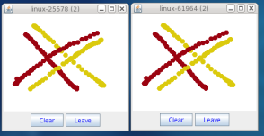

== Installation and configuration

The installation refers to version 5.x of JGroups.

JGroups can be add to the POM:

[source,xml]
----
<dependency>
  <groupId>org.jgroups</groupId>
  <artifactId>jgroups</artifactId>
  <version>5.0.0.Final</version>
</dependency>
----
    
Alternatively, the JAR can be downloaded from http://sourceforge.net/projects/javagroups/files/JGroups[SourceForge].
It is named `jgroups-x.y.z`, where `x=major`, `y=minor` and `z=patch` version, for example `jgroups-5.0.0.Final.jar`.

The JAR is all that's needed to get started using JGroups; it contains all core, demo and (selected) test
classes, some sample XML configuration files and the XML schema.

The source code is hosted on https://github.com/belaban/jgroups[GitHub]. To build JGroups,
ANT is currently used (but there's also a POM for maven users).

In <<BuildingJGroups>> we'll show how to build JGroups from source.
    

[[Requirements]]
=== Requirements

* JGroups 3.6.x to (excluding) 4.0 requires JDK 7.
* JGroups 4.x requires JDK 8.
* JGroups 5.0.0.Final requires JDK 11 or higher
* There is no JNI code present so JGroups runs on all platforms.
* Logging: by default, JGroups tries to use log4j2. If the classes are not found on the classpath, it
  resorts to log4j, and if still not found, it falls back to JDK logging (`java.util.logging logger`).
  See <<Logging>> for details on log configuration.

[[SourceStructure]]
=== Structure of the source version

The source version consists of the following directories and files:

src:: the sources

tests:: unit and stress tests

lib:: JARs needed to either run the unit tests, or build the manual etc. No JARs from here are required at runtime!
      Note that these JARs are downloaded automatically via ivy. This directory is ignored if maven is used to
      build (artifacts are in `target` instead).

conf:: configuration files needed by JGroups, plus default protocol stack definitions

doc:: documentation

[[BuildingJGroups]]
=== Building JGroups from source

* Download the sources from https://github.com/belaban/jgroups[GitHub], either via 'git clone', or the
  https://github.com/belaban/JGroups/archives/master[download link] into a directory `JGroups`, e.g. `/home/bela/JGroups`.

* Download ant (preferably 1.10 or higher)

* Change to the `JGroups` directory

* Run `ant`

* This will compile all Java files (into the `classes` directory). Note that if the `lib` directory doesn't exist,
  ant will download ivy into `lib` and then use ivy to download the dependent libraries defined in `ivy.xml`.
    
* To generate the JGroups JAR: `ant jar`

* This will generate the following JAR files in the `dist` directory:
** `jgroups-x.y.z.jar`: the JGroups JAR
** `jgroups-sources.jar`: the source code for the core classes and demos

* Now add the following directories to the classpath:
** `JGroups/classes`
** `JGroups/conf`
** All needed JAR files in `JGroups/lib`. Note that most JARs in `lib` are only required for running unit tests and
   generating test reports

* To generate JavaDocs simple run: `ant javadoc` and the Javadoc documentation will be generated in `dist/javadoc`

[[Logging]]
=== Logging

JGroups has no runtime dependencies; all that's needed to use it is to have the jgroups.jar on the classpath.
For logging, this means the JVM's logging (`java.util.logging`) is used.

However, JGroups can use any other logging framework. By default, log4j2 and slf4j are supported if the
corresponding JARs are found on the classpath.
        

[[log4j2]]
==== log4j2

To use http://logging.apache.org/log4j/2.x/manual/index.html[log4j2], the API and CORE JARs have to be found on the
classpath. There's an XML configuration for log4j2 in the conf dir, which can be used e.g. via
`-Dlog4j.configurationFile=$JGROUPS/conf/log4j2.xml`.

log4j2 is currently the preferred logging library used by JGroups, and will be used even if the log4j
JAR is also present on the classpath.

[[log4j]]
==== log4j

To use http://logging.apache.org/log4j/1.2[log4j], the log4j JAR has to be found on the classpath. Note though that
if the log4j2 API and CORE JARs are found, then log4j2 will be used, so those JARs will have to be removed if log4j
is to be used. There's an XML configuration for log4j in the conf dir, which can be used e.g. via
`-Dlog4j.configuration=file:$JGROUPS/conf/log4j.properties`.

[[JUL]]
==== JDK logging (JUL)

To force use of JDK logging, even if the log4j(2) JARs are present, `-Djgroups.use.jdk_logger=true` can be used.

[[CustomLoggers]]
==== Support for custom logging frameworks

JGroups allows custom loggers to be used instead of the ones supported by default. To do this, interface
`CustomLogFactory` has to be implemented:

[source,java]
----
public interface CustomLogFactory {
    Log getLog(Class clazz);
    Log getLog(String category);
}
----

The implementation needs to return an implementation of `org.jgroups.logging.Log`.

To use the custom log, `LogFactory.setCustomLogFactory(CustomLogFactory f)` needs to be called.

==== Setting the preferred log class

It is possible to set the preferred log class via system property `jgroups.log_class`. To do this, the fully
qualified name of a class which provides the following functionality has to be given:

* Implement the `Log` interface
* Provide a constructor taking a `Class` type as only argument
* Provide a constructor taking a `String` type as only argument

Example: `-Djgroups.log_class=org.jgroups.logging.Slf4jLogImpl`

[[TestingTheSetup]]
=== Testing your setup

To see whether your system can find the JGroups classes, execute the following command:

......
java org.jgroups.Version
......

or

....
java -jar jgroups-x.y.z.jar
....

You should see the following output (more or less) if the class is found:

----
$  java org.jgroups.Version

Version:      5.0.0.Final (Stelvio)
----

[[RunningTheDemo]]
=== Running a demo program

To test whether JGroups works okay on your machine, run the following command twice:

----
java org.jgroups.demos.Draw
----

2 whiteboard windows should appear as shown in <<DrawScreenshotFig>>.

[[DrawScreenshotFig]]
.Screenshot of 2 Draw instances

The `(2)` in the title means that the two instances found each other and formed a cluster.

When drawing in one window, the second instance should also be updated. As the default group transport
uses IP multicast, make sure that - if you want start the 2 instances in different subnets
- IP multicast is enabled. If this is not the case, the 2 instances won't find each other and the
example won't work.

You can change the properties of the demo to for example use a different transport if multicast doesn't work
(it should always work on the same machine). Please consult the documentation for how to do this.
         
State transfer (see the section in the API later) can also be tested by passing the `-state` flag to Draw.
        

=== Using IP Multicasting without a network connection

Sometimes there isn't a network connection (e.g. DSL modem is down), or we want to multicast only on the local machine.
For this the loopback interface (typically lo) can be configured, e.g.

....
route add -net 224.0.0.0 netmask 240.0.0.0 dev lo
....

This means that all traffic directed to the `224.0.0.0` network will be sent to the loopback interface, which means it
doesn't need any network to be running. Note that the `224.0.0.0` network is a placeholder for all multicast addresses
in most UNIX implementations: it will catch _all_ multicast traffic.

The above instructions may also work for Windows systems, but this hasn't
been tested. Note that not all operating systems allow multicast traffic to use the loopback interface.

Typical home networks have a gateway/firewall with 2 NICs:
the first (e.g. `eth0`) is connected to the outside world (Internet Service Provider), the second (`eth1`) to the
internal network, with the gateway firewalling/masquerading traffic between the internal and external networks.

If no route for multicast traffic is added, the default will be to use the fdefault gateway, which will typically
direct the multicast traffic towards the ISP. To prevent this (e.g. ISP drops multicast traffic, or latency
is too high), we recommend to add a route for multicast traffic which goes to the internal network (e.g. `eth1`).

[[ItDoesntWork]]
=== It doesn't work!

Make sure your machine is set up correctly for IP multicasting. There is a test program `mcast` which can be used to
check if IP multicasting works.

The options are:

 `-bind_addr`:: the network interface to bind to for the receiver. If null, `mcast` will join all
                available interfaces
 `-port`:: the local port to use. If 0, an ephemeral port will be picked
 `-mcast_addr`:: the multicast address to join
 `-mcast_port`:: the port to listen on for multicasts
 `-ttl`:: The TTL (for sending of packets)

Start multiple instances of mcast:

----
java org.jgroups.tests.mcast
----

If you want to bind to a specific network interface card (NIC), use `-bind_addr 192.168.0.2`, where `192.168.0.2`
is the IP address of the NIC to which you want to bind. Use this parameter in both sender and receiver.

You should be able to type in the mcast window and see the output in all other instance. If not, try to use `-ttl 32`
in the sender. If this still fails, consult a system administrator to help you setup IP multicast correctly. If you
_are_ the system administrator, look for another job :-)

Other means of getting help: there is a public forum on http://jira.jboss.com/jira/browse/JGRP[JIRA]
for questions. Also consider subscribing to the javagroups-users mailing list to discuss such and other problems.

[[IPv6Issues]]
=== Problems with IPv6

Another source of problems might be the use of IPv6, and/or misconfiguration of `/etc/hosts`. If you communicate between
an IPv4 and an IPv6 host, and they are not able to find each other, try the `-Djava.net.preferIPv4Stack=true`
property, e.g.

----
java -Djava.net.preferIPv4Stack=true org.jgroups.demos.Draw -props /home/bela/udp.xml
----

The JDK uses IPv6 by default, although is has a dual stack, that is, it also supports IPv4.
To force use of IPv6, start your JVM with `-Djava.net.preferIPv6Addresses=true`.

=== I have discovered a bug!

If you think that you discovered a bug, submit a bug report on
http://jira.jboss.com/jira/browse/JGRP[JIRA] or send email to the jgroups-users mailing list if you're unsure about it.
Please include the following information:
        
- [x] Version of JGroups (java org.jgroups.Version)
- [x] Platform (e.g. Solaris 8)
- [ ] Version of JDK (e.g. JDK 1.6.20_52)
- [ ] Stack trace in case of a hang. Use kill -3 PID on UNIX systems or CTRL-BREAK on windows machines
- [x] Small program that reproduces the bug (if it can be reproduced)

[[SupportedClasses]]
=== Supported classes

JGroups project has been around since 1998. Over this time, some of the JGroups classes
have been used in experimental phases and have never been matured enough to be used in today's production
releases. However, they have not been removed, since some people use them in their products.
    
The following tables list unsupported and experimental classes. These classes are not actively maintained, and
we will not work to resolve potential issues you might find. Their final fate is not yet determined; they
might even be removed altogether in the next major release. Weight your risks if you decide to use them anyway.
    

[[ExperimentalClasses]]
==== Experimental classes

${Experimental}

[[UnsupportedClasses]]
==== Unsupported classes

${Unsupported}

