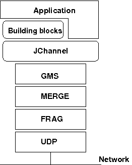

== Overview

Group communication uses the terms _group_ and _member_. Members are part of a group. In the more common terminology,
a member is a _node_ and a group is a _cluster_. We use these terms interchangeably.
    

A node is a process, residing on some host. A cluster can have one or more nodes belonging to it. There can be multiple
nodes on the same host, and all may or may not be part of the same cluster.
Nodes can of course also run on different hosts.
    

JGroups is toolkit for reliable group communication. Processes can join a group, send messages to all
members or single members and receive messages from members in the group. The system keeps track of the
members in every group, and notifies group members when a new member joins, or an existing
member leaves or crashes. A group is identified by its name. Groups do not have to be created explicitly;
when a process joins a non-existing group, that group will be created automatically. Processes of a group can
be located on the same host, within the same LAN, or across a WAN. A member can be part of multiple groups.
    

The architecture of JGroups is shown in <<ArchitectureFig>>.
    

[[ArchitectureFig]]
.The architecture of JGroups

It consists of 3 parts: (1) the Channel used by application programmers to build reliable group communication
applications, (2) the building blocks, which are layered on top of the channel and provide a higher abstraction level
and (3) the protocol stack, which implements the properties specified for a given channel.

This document describes how to install and _use_ JGroups, ie. the Channel API and the
building blocks. The targeted audience is application programmers who want to use JGroups to
build reliable distributed programs that need group communication.
    

A channel is connected to a protocol stack. Whenever the application sends a message, the channel passes it on to the
protocol stack, which passes it to the topmost protocol. The protocol processes the message and the passes it down to
the protocol below it. Thus the message is handed from protocol to protocol until the bottom (transport) protocol puts
it on the network.

The same happens in the reverse direction: the transport protocol listens for messages on the network. When a message is
received it will be handed up the protocol stack until it reaches the channel. The channel then invokes the receive()
callback in the application to deliver the message.

When an application connects to the channel, the protocol stack will be started, and when it disconnects the
stack will be stopped. When the channel is closed, the stack will be destroyed, releasing its resources.
    

The following three sections give an overview of channels, building blocks and the protocol stack.
    

=== Channel

To join a group and send messages, a process has to create a _channel_ and connect to it using the group
name (all channels with the same name form a group). The channel is the handle to the group. While connected,
a member may send and receive messages to/from all other group members. The client leaves a group by disconnecting
from the channel. A channel can be reused: clients can connect to it again after having disconnected. However, a channel
allows only 1 client to be connected at a time. If multiple groups are to be joined, multiple channels can be created
and connected to. A client signals that it no longer wants to use a channel by closing it. After this operation,
the channel cannot be used any longer.

Each channel has a unique address. Channels always know who
the other members are in the same group: a list of member
addresses can be retrieved from any channel. This list is called a
_view_. A process can select an address from
this list and send a unicast message to it (also to itself), or it
may send a multicast message to all members of the current
view (also including itself). Whenever a process joins or leaves a group, or when a
crashed process has been detected, a new _view_
is sent to all remaining group members. When a member process is
suspected of having crashed, a _suspicion message_ is received by all non-faulty members. Thus,
channels receive regular messages, and view and suspicion notifications.

The properties of a channel are typically defined in an XML file, but JGroups also allows for configuration
through simple strings, URIs, DOM trees or even programmatically.

The Channel API and its related classes is described in <<user-channel,the API section>>.

=== Building Blocks

Channels are simple and primitive. They offer the bare
functionality of group communication, and have been
designed after the simple model of sockets, which are widely
used and well understood. The reason is that an application can
make use of just this small subset of JGroups, without having
to include a whole set of sophisticated classes, that it may not
even need. Also, a somewhat minimalistic interface is simple to
understand: a client needs to know about 5 methods to be able to
create and use a channel.

Channels provide asynchronous message sending/reception,
somewhat similar to UDP. A message sent is essentially put on the
network and the send() method will return immediately. Conceptual
_requests_, or _responses_
to previous requests, are received in undefined order, and the
application has to take care of matching responses with requests.

JGroups offers building blocks that provide more
sophisticated APIs on top of a Channel. Building blocks either
create and use channels internally, or require an existing channel
to be specified when creating a building block. Applications
communicate directly with the building block, rather than the
channel. Building blocks are intended to save the application
programmer from having to write tedious and recurring code,
e.g. request-response correlation, and thus offer a higher level of abstraction to group communication.

Building blocks are described in <<user-building-blocks>>.

=== The Protocol Stack

The protocol stack containins a number of protocol layers in a bidirectional
list. All messages sent and received over the channel have to pass
through all protocols. Every layer may modify, reorder, pass
or drop a message, or add a header to a message. A fragmentation
layer might break up a message into several smaller messages,
adding a header with an id to each fragment, and re-assemble the
fragments on the receiver's side.

The composition of the protocol stack, i.e. its protocols, is
determined by the creator of the channel: an XML file
defines the protocols to be used (and the parameters for each
protocol). The configuration is then used to create the stack.

Knowledge about the protocol stack is not necessary when
only _using_ channels in an
application. However, when an application wishes to ignore the
default properties for a protocol stack, and configure their own
stack, then knowledge about what the individual layers are
supposed to do is needed.

