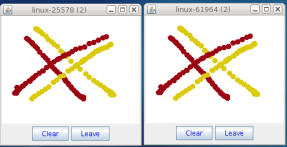

== Installation


=== Download
JGroups can be downloaded http://sourceforge.net/projects/javagroups/files/JGroups[here].
For this tutorial, I'm using the binary version of JGroups 4.0, so download one of the jgroups-4.x.y.jar
files (e.g. jgroups-4.0.0.Final.jar).
        

This JAR file contains:
            
* JGroups core, demo and (selected) test classes
* Sample configuration files, e.g. udp.xml or tcp.xml


NOTE: JGroups 4.x requires JDK 8


==== Maven
Maven / Gradle / Ivy etc can be used to include JGroups:

```
groupId: org.jgroups
artifactId: jgroups
version: 4.0.0.Final (for example)
```


=== Configuration
Add jgroups-4.x.y.jar to your classpath. If you use the log4j2 logging system, you also have to add log4j2.jar
(this is not necessary if you use the JDK logging system).
        


=== Testing your Setup
To see whether your system can find the JGroups classes, execute the following command:

----
java org.jgroups.Version
----

or

----
java -jar jgroups-4.x.y.jar
----

You should see the following output (more or less) if the class is found:

----
$  java org.jgroups.Version
   Version:      4.0.0.Final
----


=== Running a Demo Program
To test whether JGroups works okay on your machine, run the following command twice:

----
java org.jgroups.demos.Draw
----

Two whiteboard windows should appear as shown below:



If you started them simultaneously, they could initially show a membership of 1 in their title bars. After some time,
both windows should show 2. This means that the two instances found each other and formed a cluster.
        
When drawing in one window, the second instance should also be updated. As the default group transport uses
IP multicast, make sure that - if you want start the 2 instances in different subnets - IP multicast is enabled.
If this is not the case, the 2 instances won't 'find' each other and the example won't work.

If the 2 instances find each other and form a cluster, you can skip ahead to the next chapter
("Writing a simple application").
        


=== Using JGroups without a network
(You may skip this section if the 2 instances found each other correctly in the previous section).
        
Sometimes there isn't a network connection (e.g. DSL modem is down), or we want to multicast only on the
local machine. To do this, we can use the loopback device (127.0.0.1):

----
java -Djgroups.bind_addr=127.0.0.1 org.jgroups.demos.Draw
----

You should again see 2 instances of Draw which form a cluster. If this is not the case, you may
have to add a multicast route to the loopback device (this requires superuser or admin privileges):
        
----
route add -net 224.0.0.0 netmask 240.0.0.0 dev lo
----

This means that all traffic directed to the 224.0.0.0 network will be sent to the loopback interface,
which means it doesn't need any network to be running.
        

Typical home networks have a gateway/firewall with 2 NICs: the first (eth0) is connected to the outside
world (Internet Service Provider), the second (eth1) to the internal network, with the gateway
firewalling/masquerading traffic between the internal and external networks. If no route for multicast
traffic is added, the default will be to use the default gateway, which will typically direct the
multicast traffic towards the ISP. To prevent this (e.g. ISP drops multicast traffic, or latency is too
high), we recommend to add a route for multicast traffic which goes to the internal network (e.g. eth1).
        

=== Trouble shooting
If the 2 Draw instances don't find each other, read INSTALL.html, which comes with JGroups and has more
detailed trouble shooting information. In a nutshell, there are multiple possible reasons the cluster
doesn't form:
            
* A firewall discards packets. To verify this, turn the firewall off. If the cluster forms, then turn
  the firewall back on and selectively add rules to let JGroups traffic pass.
* Use of IPv6. JGroups does work with IPv6, but some JDK implementations still have issues with it, so
  you can turn IPv6 off by passing the "-Djava.net.preferIPv4Stack=true" system property to the JVM.
  You can force use of IPv6 addresses by using setting system property
  -Djava.net.preferIPv6Addresses=true. If you use IPv6 addresses, you should also define IPv6 addresses
  in your configuration; e.g. if you set bind_addr="192.168.1.5" in UDP, JGroups will try to pick
  IPv4 addresses if an IPv4 stack is available, or you're running a dual stack.
* You don't use the right network interface (NIC): define the NIC with the -Djgroups.bind_addr system
  property:
----
java -Djgroups.bind_addr=192.168.5.2 java.org.jgroups.demos.Draw
----
* There is no multicast route for the chosen NIC.


        

